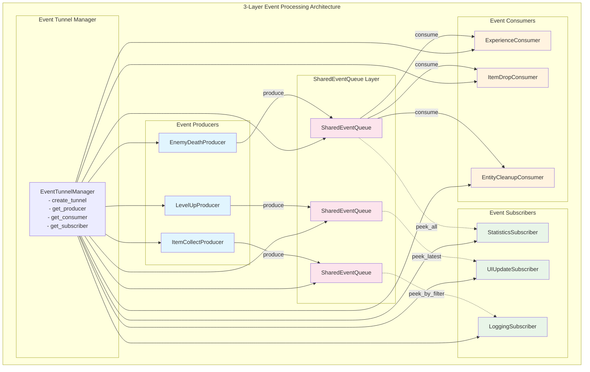
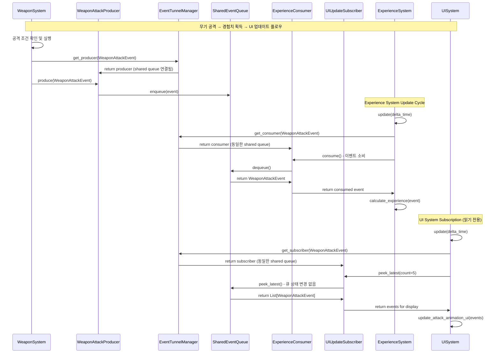
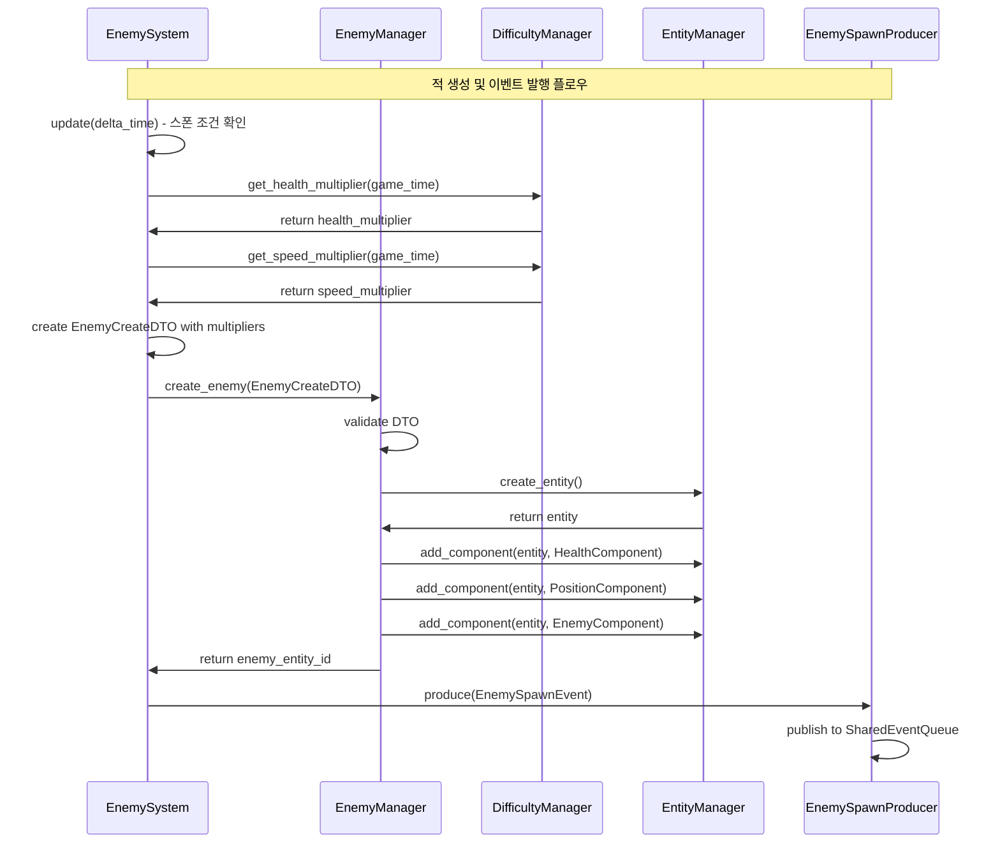

# 방과후생존 게임 - 신규 아키텍처 PRD v0.4 (Product Requirements Document)

## 📋 문서 정보

- **문서 타입**: 신규 아키텍처 설계 중심 PRD v0.4
- **작성일**: 2025-01-25
- **아키텍트**: 시니어 게임 아키텍트
- **기반 문서**: [design2.md](./design2.md), [DEV-PRDv0.3.md](./DEV-PRDv0.3.md)
- **주요 변경사항**: 완전 신규 구축 아키텍처 - Producer-Consumer-Subscriber 패턴 기반
- **변경 근거**: 기존 혼재된 책임을 명확히 분리하고 확장 가능한 인터페이스 우선 설계 적용
- **설계 철학**: 계약 기반 설계, 책임 분리 우선, 타입 안전성 보장

---

# 1. 프로젝트 개요 (Project Overview)

## 1.1 게임 컨셉

**"10분 동안 아무 생각 없이 몰입하여 스트레스를 해소하는"** 하이퍼 캐주얼 로그라이크 생존 게임

### 핵심 플레이 루프

```
플레이어 시작 → 마우스 이동 → 자동 공격 → 적 처치 → 경험치 획득 
→ 레벨업 → 아이템 선택 → 시너지 조합 → 보스 대응 → 성장 → 반복
```

### 기술적 목표

- **플랫폼**: PC (Windows, macOS) → **모바일 확장 고려**
- **개발 언어**: Python 3.13+
- **게임 엔진**: Pygame 2.6.0+
- **성능 목표**: 40+ FPS (60fps/40fps 설정 선택)
- **개발 기간**: 신규 구축 4-5개월

### 🆕 핵심 아키텍처 설계 원칙

1. **인터페이스 우선 설계**: 모든 컴포넌트를 인터페이스부터 정의
2. **계약 기반 개발**: 구현체는 완전 교체 가능한 구조
3. **책임 분리 극대화**: 각 컴포넌트의 단일 책임 명확화
4. **타입 안전성 보장**: 제네릭과 DTO로 컴파일 타임 검증
5. **🆕 3-Layer 이벤트 처리**: Producer-Consumer-Subscriber 명확한 역할 분리
6. **성능 최적화 준비**: 인터페이스 기반으로 최적화 구현체 교체 가능

---

# 2. 🆕 ECS Foundation Layer (Entity-Component-System 기반)

## 2.1 ECS 아키텍처 핵심 설계

### Entity: 순수 식별자

```python
@dataclass
class Entity:
    """순수한 게임 객체 식별자"""
    id: str
    _active: bool = True
    
    @classmethod
    def create(cls) -> "Entity":
        """UUID 기반 새 엔티티 생성"""
        return cls(id=str(uuid.uuid4()))
```

### Component: 순수 데이터 컨테이너

```python
@dataclass
class Component(ABC):
    """모든 컴포넌트의 기본 클래스 - 순수 데이터만 포함"""
    
    def validate(self) -> bool:
        """데이터 유효성 검증 - 기본 구현, 오버라이드 가능"""
        return True
    
    def serialize(self) -> dict[str, Any]:
        """직렬화 지원 - dataclass 필드 자동 직렬화"""
        return {
            field.name: getattr(self, field.name)
            for field in self.__dataclass_fields__.values()
        }
    
    @classmethod
    def deserialize(cls, data: dict[str, Any]) -> 'Component':
        """역직렬화 지원 - dict에서 Component 생성"""
        return cls(**data)
    
    def copy(self) -> 'Component':
        """깊은 복사 생성 - 불변성 보장"""
        import copy
        return copy.deepcopy(self)
    
    def shallow_copy(self) -> 'Component':
        """얕은 복사 생성 - 성능 최적화용"""
        return type(self)(
            **{
                field.name: getattr(self, field.name)
                for field in self.__dataclass_fields__.values()
            }
        )
    
    def merge_from(self, other: 'Component') -> 'Component':
        """다른 컴포넌트의 None이 아닌 값들로 업데이트"""
        if not isinstance(other, type(self)):
            raise TypeError(f"Cannot merge {type(other)} into {type(self)}")
        
        updated_data = {}
        for field in self.__dataclass_fields__.values():
            other_value = getattr(other, field.name)
            if other_value is not None:
                updated_data[field.name] = other_value
            else:
                updated_data[field.name] = getattr(self, field.name)
        
        return type(self)(**updated_data)
    
    def diff(self, other: 'Component') -> dict[str, tuple[Any, Any]]:
        """다른 컴포넌트와의 차이점 반환 - 디버깅/로깅용"""
        if not isinstance(other, type(self)):
            raise TypeError(f"Cannot compare {type(other)} with {type(self)}")
        
        differences = {}
        for field in self.__dataclass_fields__.values():
            self_value = getattr(self, field.name)
            other_value = getattr(other, field.name)
            if self_value != other_value:
                differences[field.name] = (self_value, other_value)
        
        return differences
    
    def is_equal_to(self, other: 'Component', ignore_fields: list[str] = None) -> bool:
        """특정 필드를 제외하고 동등성 비교"""
        if not isinstance(other, type(self)):
            return False
        
        ignore_fields = ignore_fields or []
        for field in self.__dataclass_fields__.values():
            if field.name in ignore_fields:
                continue
            if getattr(self, field.name) != getattr(other, field.name):
                return False
        
        return True
    
    def get_field_names(self) -> list[str]:
        """컴포넌트의 모든 필드명 반환 - 리플렉션용"""
        return list(self.__dataclass_fields__.keys())
    
    def get_field_types(self) -> dict[str, type]:
        """컴포넌트의 필드 타입 정보 반환 - 타입 검증용"""
        return {
            field.name: field.type 
            for field in self.__dataclass_fields__.values()
        }
    
    def update_field(self, field_name: str, value: Any) -> 'Component':
        """특정 필드만 업데이트한 새 인스턴스 반환 - 불변성 유지"""
        if field_name not in self.__dataclass_fields__:
            raise ValueError(f"Field '{field_name}' does not exist in {type(self)}")
        
        current_data = self.serialize()
        current_data[field_name] = value
        return type(self)(**current_data)
    
    def reset_to_defaults(self) -> 'Component':
        """모든 필드를 기본값으로 리셋한 새 인스턴스 반환"""
        return type(self)()
    
    def __str__(self) -> str:
        """사람이 읽기 쉬운 문자열 표현"""
        class_name = self.__class__.__name__
        field_strs = []
        for field in self.__dataclass_fields__.values():
            value = getattr(self, field.name)
            # 긴 값은 축약하여 표시
            if isinstance(value, str) and len(value) > 20:
                value = value[:17] + "..."
            field_strs.append(f'{field.name}={value}')
        return f'{class_name}({", ".join(field_strs)})'
```

## 2.2 기존 컴포넌트 분석 및 분류

### 🎮 핵심 게임플레이 컴포넌트

**PositionComponent**: 월드 좌표 위치
```python
@dataclass
class PositionComponent(Component):
    x: float = 0.0
    y: float = 0.0
    
    def get_position(self) -> tuple[float, float]:
        return (self.x, self.y)
```

**EnemyComponent**: 적 속성 및 타입
```python
@dataclass 
class EnemyComponent(Component):
    enemy_type: EnemyType = EnemyType.KOREAN
    difficulty_level: int = 1
    experience_reward: int = 10
    is_boss: bool = False
```

**WeaponComponent**: 무기 속성 및 공격 설정
```python
@dataclass
class WeaponComponent(Component):
    weapon_type: WeaponType = WeaponType.SOCCER_BALL
    damage: int = 10
    attack_speed: float = 1.0
    range: float = 100.0
```

**ProjectileComponent**: 투사체 물리 및 데미지
```python
@dataclass
class ProjectileComponent(Component):
    velocity_x: float = 0.0
    velocity_y: float = 0.0
    damage: int = 10
    lifetime: float = 2.0
    piercing: bool = False
```

### 🎨 렌더링 컴포넌트

**RenderComponent**: 시각적 표현
```python
@dataclass
class RenderComponent(Component):
    color: tuple[int, int, int] = (255, 255, 255)
    size: float = 20.0
    shape: str = "circle"
    layer: RenderLayer = RenderLayer.ENTITIES
```

### ⚡ 물리/이동 컴포넌트

**VelocityComponent**: 속도 벡터
```python
@dataclass
class VelocityComponent(Component):
    vx: float = 0.0
    vy: float = 0.0
    max_speed: float = 100.0
```

**CollisionComponent**: 충돌 감지
```python
@dataclass
class CollisionComponent(Component):
    radius: float = 10.0
    layer: CollisionLayer = CollisionLayer.DEFAULT
    solid: bool = True
```

### 🎯 특화 컴포넌트

**PlayerComponent**: 플레이어 식별 및 상태
**HealthComponent**: 체력 관리
**ExperienceComponent**: 경험치 시스템
**CameraComponent**: 카메라 설정

## 2.3 Component Registry (컴포넌트 타입 관리)

### 설계 목적
- 컴포넌트 타입별 메타데이터 중앙 관리
- 런타임 컴포넌트 타입 검증 및 생성
- 컴포넌트 팩토리 패턴 지원
- 직렬화/역직렬화 동작 자동화

```python
from typing import Type, Dict, Any, Optional, List, Set
from abc import ABC, abstractmethod
from dataclasses import is_dataclass
from ..core.component import Component

class ComponentRegistry:
    """
    컴포넌트 타입 및 메타데이터 중앙 관리 레지스트리.
    
    - 컴포넌트 타입 등록 및 검색
    - 타입 안전성 검증
    - 컴포넌트 팩토리 기능
    - 런타임 리플렉션 지원
    """
    
    def __init__(self):
        # 컴포넌트 타입별 메타데이터 저장
        self._component_types: Dict[str, Type[Component]] = {}
        self._component_schemas: Dict[str, Dict[str, type]] = {}
        self._component_defaults: Dict[str, Dict[str, Any]] = {}
        self._component_validators: Dict[str, List[callable]] = {}
    
    def register_component(self, component_class: Type[Component]) -> bool:
        """
        컴포넌트 클래스를 레지스트리에 등록
        
        Args:
            component_class: 등록할 컴포넌트 클래스
            
        Returns:
            등록 성공 여부
        """
        # 타입 안전성 검증
        if not self._validate_component_type(component_class):
            return False
        
        component_name = component_class.__name__
        
        # 컴포넌트 타입 등록
        self._component_types[component_name] = component_class
        
        # 스키마 추출 및 저장
        self._component_schemas[component_name] = self._extract_schema(component_class)
        
        # 기본값 추출 및 저장
        self._component_defaults[component_name] = self._extract_defaults(component_class)
        
        # 밸리데이터 초기화
        self._component_validators[component_name] = []
        
        return True
    
    def get_component_type(self, component_name: str) -> Optional[Type[Component]]:
        """컴포넌트 타입 반환"""
        return self._component_types.get(component_name)
    
    def create_component(self, component_name: str, **kwargs) -> Optional[Component]:
        """
        컴포넌트 인스턴스 생성 - 팩토리 패턴
        
        Args:
            component_name: 생성할 컴포넌트 이름
            **kwargs: 컴포넌트 초기화 매개변수
            
        Returns:
            생성된 컴포넌트 인스턴스
        """
        component_class = self.get_component_type(component_name)
        if not component_class:
            return None
        
        # 기본값과 전달된 값 병합
        defaults = self._component_defaults[component_name].copy()
        defaults.update(kwargs)
        
        try:
            # 컴포넌트 생성
            component = component_class(**defaults)
            
            # 밸리데이션 수행
            if self._validate_component_instance(component):
                return component
        except Exception as e:
            print(f"Component creation failed for {component_name}: {e}")
        
        return None
    
    def get_component_schema(self, component_name: str) -> Optional[Dict[str, type]]:
        """컴포넌트 스키마 반환"""
        return self._component_schemas.get(component_name)
    
    def get_all_component_types(self) -> Set[str]:
        """등록된 모든 컴포넌트 타입 이름 반환"""
        return set(self._component_types.keys())
    
    def validate_component_data(self, component_name: str, data: Dict[str, Any]) -> bool:
        """컴포넌트 데이터 유효성 검증"""
        schema = self.get_component_schema(component_name)
        if not schema:
            return False
        
        # 타입 일치성 검사
        for field_name, expected_type in schema.items():
            if field_name in data:
                if not isinstance(data[field_name], expected_type):
                    return False
        
        return True
    
    def serialize_component(self, component: Component) -> Optional[Dict[str, Any]]:
        """컴포넌트 직렬화"""
        try:
            return component.serialize()
        except Exception:
            return None
    
    def deserialize_component(self, component_name: str, data: Dict[str, Any]) -> Optional[Component]:
        """컴포넌트 역직렬화"""
        component_class = self.get_component_type(component_name)
        if not component_class:
            return None
        
        try:
            return component_class.deserialize(data)
        except Exception:
            return None
    
    def _validate_component_type(self, component_class: Type) -> bool:
        """컴포넌트 타입 유효성 검상"""
        # Component 기반 클래스인지 확인
        if not issubclass(component_class, Component):
            return False
        
        # dataclass인지 확인
        if not is_dataclass(component_class):
            return False
        
        return True
    
    def _extract_schema(self, component_class: Type[Component]) -> Dict[str, type]:
        """컴포넌트에서 스키마 추출"""
        if hasattr(component_class, '__dataclass_fields__'):
            return {
                field.name: field.type 
                for field in component_class.__dataclass_fields__.values()
            }
        return {}
    
    def _extract_defaults(self, component_class: Type[Component]) -> Dict[str, Any]:
        """컴포넌트에서 기본값 추출"""
        defaults = {}
        if hasattr(component_class, '__dataclass_fields__'):
            for field in component_class.__dataclass_fields__.values():
                if field.default is not field.default_factory:
                    defaults[field.name] = field.default
        return defaults
    
    def _validate_component_instance(self, component: Component) -> bool:
        """컴포넌트 인스턴스 밸리데이션"""
        try:
            return component.validate()
        except Exception:
            return False
```

## 2.4 System Orchestrator (시스템 실행 순서 제어)

### 설계 목적
- 시스템 간 실행 순서 제어 및 의존성 관리
- 시스템 라이프사이클 관리 (init/update/cleanup)
- 성능 업쓰로틀링 및 병렬 처리 지원
- 시스템 동적 활성화/비활성화

```python
from typing import List, Dict, Set, Optional, Callable
from enum import IntEnum
from dataclasses import dataclass, field
from abc import ABC, abstractmethod
from ..core.system import System

class SystemPriority(IntEnum):
    """시스템 우선순위 레벨"""
    CRITICAL = 0     # 카메라, 입력 시스템
    HIGH = 10        # 물리, 충돌 시스템
    NORMAL = 50      # 게임플레이 로직
    LOW = 100        # 렌더링, UI 시스템
    BACKGROUND = 200 # 디버그, 메트릭스

@dataclass
class SystemInfo:
    """시스템 메타데이터"""
    system: System
    name: str
    priority: SystemPriority
    dependencies: Set[str] = field(default_factory=set)
    dependents: Set[str] = field(default_factory=set)
    active: bool = True
    parallel_safe: bool = False
    
class SystemOrchestrator:
    """
    시스템 라이프사이클과 실행 순서를 제어하는 오케스트레이터.
    
    기능:
    - 시스템 등록 및 의존성 관리
    - 우선순위 기반 실행 순서 결정
    - 성능 업쓰로틀링 및 병렬 처리
    - 시스템 동적 제어
    """
    
    def __init__(self):
        self._systems: Dict[str, SystemInfo] = {}
        self._execution_order: List[str] = []
        self._parallel_groups: List[Set[str]] = []
        self._system_stats: Dict[str, Dict[str, float]] = {}
        self._update_callbacks: List[Callable] = []
        
    def register_system(self, 
                      system: System, 
                      name: str, 
                      priority: SystemPriority = SystemPriority.NORMAL,
                      dependencies: Optional[Set[str]] = None,
                      parallel_safe: bool = False) -> bool:
        """
        시스템 등록 및 의존성 설정
        
        Args:
            system: 등록할 시스템 인스턴스
            name: 시스템 고유 식별명
            priority: 시스템 우선순위
            dependencies: 사전 실행 필요한 시스템들
            parallel_safe: 병렬 실행 가능 여부
            
        Returns:
            등록 성공 여부
        """
        if name in self._systems:
            return False  # 이미 등록된 시스템
        
        # 의존성 유효성 검사
        dependencies = dependencies or set()
        for dep in dependencies:
            if dep not in self._systems:
                print(f"Warning: Dependency '{dep}' not found for system '{name}'")
        
        # 시스템 정보 생성 및 등록
        system_info = SystemInfo(
            system=system,
            name=name,
            priority=priority,
            dependencies=dependencies,
            parallel_safe=parallel_safe
        )
        
        self._systems[name] = system_info
        
        # 의존성 역방향 링크 설정
        for dep in dependencies:
            if dep in self._systems:
                self._systems[dep].dependents.add(name)
        
        # 실행 순서 재계산
        self._recalculate_execution_order()
        
        # 시스템 초기화
        system.initialize()
        
        return True
    
    def update_all_systems(self, delta_time: float) -> None:
        """모든 시스템 순차적 업데이트"""
        import time
        
        for system_name in self._execution_order:
            if system_name not in self._systems:
                continue
                
            system_info = self._systems[system_name]
            if not system_info.active:
                continue
            
            # 성능 측정 시작
            start_time = time.perf_counter()
            
            try:
                # 시스템 업데이트
                system_info.system.update(delta_time)
                
                # 성능 통계 기록
                execution_time = time.perf_counter() - start_time
                self._update_system_stats(system_name, execution_time)
                
            except Exception as e:
                print(f"System '{system_name}' update failed: {e}")
    
    def set_system_active(self, name: str, active: bool) -> bool:
        """시스템 활성화/비활성화"""
        if name not in self._systems:
            return False
        self._systems[name].active = active
        return True
    
    def get_system_stats(self) -> Dict[str, Dict[str, float]]:
        """시스템 성능 통계 반환"""
        return self._system_stats.copy()
    
    def _recalculate_execution_order(self) -> None:
        """의존성과 우선순위를 고려한 실행 순서 재계산"""
        # 토폴로지 정렬 (Topological Sort)
        visited = set()
        temp_visited = set()
        result = []
        
        def dfs(system_name: str):
            if system_name in temp_visited:
                raise ValueError(f"Circular dependency detected involving {system_name}")
            if system_name in visited:
                return
            
            temp_visited.add(system_name)
            
            # 의존 시스템들 먼저 처리
            system_info = self._systems[system_name]
            for dep in system_info.dependencies:
                if dep in self._systems:
                    dfs(dep)
            
            temp_visited.remove(system_name)
            visited.add(system_name)
            result.append(system_name)
        
        # 모든 시스템에 대해 DFS 수행
        for system_name in self._systems:
            if system_name not in visited:
                dfs(system_name)
        
        # 우선순위로 추가 정렬
        result.sort(key=lambda name: self._systems[name].priority)
        
        self._execution_order = result
    
    def _update_system_stats(self, system_name: str, execution_time: float) -> None:
        """시스템 성능 통계 업데이트"""
        if system_name not in self._system_stats:
            self._system_stats[system_name] = {
                'avg_time': 0.0,
                'max_time': 0.0,
                'min_time': float('inf'),
                'total_calls': 0
            }
        
        stats = self._system_stats[system_name]
        stats['total_calls'] += 1
        stats['max_time'] = max(stats['max_time'], execution_time)
        stats['min_time'] = min(stats['min_time'], execution_time)
        
        # 이동 평균 계산
        alpha = 0.1  # 지수 이동 평균 가중치
        if stats['avg_time'] == 0.0:
            stats['avg_time'] = execution_time
        else:
            stats['avg_time'] = (1 - alpha) * stats['avg_time'] + alpha * execution_time
```

## 2.5 ECS 기반 아키텍처 다이어그램

```mermaid
graph TB
    subgraph "ECS Foundation Layer"
        Entity["Entity
        - entity_id: str
        - active: bool"]
        Component["Component
        - ABC Base
        - validate
        - serialize"]
        ComponentRegistry["ComponentRegistry
        - register_component()
        - create_component()
        - validate_component_data()"]
        SystemOrchestrator["SystemOrchestrator
        - register_system()
        - update_all_systems()
        - _recalculate_execution_order()"]
        
        subgraph "Core Game Components"
            PositionComp["PositionComponent
            - x, y: float
            - get_position()"]
            EnemyComp["EnemyComponent
            - enemy_type: EnemyType
            - difficulty_level: int
            - is_boss: bool"]
            WeaponComp["WeaponComponent
            - weapon_type: WeaponType
            - damage: int
            - attack_speed: float"]
            ProjectileComp["ProjectileComponent
            - velocity_x, velocity_y
            - damage, lifetime
            - piercing: bool"]
        end
        
        subgraph "Render Components"
            RenderComp["RenderComponent
            - color, size
            - shape, layer"]
        end
        
        subgraph "Physics Components" 
            VelocityComp["VelocityComponent
            - vx, vy: float
            - max_speed: float"]
            CollisionComp["CollisionComponent
            - radius: float
            - layer, solid"]
        end
        
        subgraph "Specialized Components"
            PlayerComp["PlayerComponent
            - player_id
            - level, experience"]
            HealthComp["HealthComponent
            - current, maximum
            - regeneration_rate"]
            CameraComp["CameraComponent
            - target_entity
            - offset, zoom"]
        end
    end
    
    subgraph "ECS Management Layer"
        EntityManager["EntityManager
        - create_entity()
        - add_component()
        - get_component()
        - query_entities()"]
        ComponentRegistry["ComponentRegistry
        - component storage
        - type management
        - batch operations"]
    end
    
    %% Relationships
    EntityManager --> Entity
    Component --> PositionComp
    Component --> EnemyComp
    Component --> WeaponComp
    Component --> ProjectileComp
    Component --> RenderComp
    Component --> VelocityComp
    Component --> CollisionComp
    Component --> PlayerComp
    Component --> HealthComp
    Component --> CameraComp
    
    EntityManager --> ComponentRegistry
    EntityManager --> Component
```



# 3. 🆕 3-Layer Event System Architecture (ECS 기반)

## 3.1 이벤트 처리 역할 분리

### 핵심 설계 철학

```
불변성 보장 + 소비 명확화 + 생성 통제 = 안전하고 예측 가능한 이벤트 처리
```

### 3-Layer 역할 정의

**🔍 IEventSubscriber<T>: 읽기 전용 구독자**
- **역할**: 이벤트를 읽기만 하고 큐 상태 변경 없음
- **보장**: 이벤트 불변성 유지
- **용도**: 상태 조회, 통계, 로깅, 모니터링

**🔥 IEventConsumer<T>: 소비 전용 처리자**
- **역할**: 이벤트를 큐에서 제거(소비)만 담당
- **제한**: 이벤트 수정 불가능
- **용도**: 이벤트 처리 완료 후 정리, 작업 완료 마킹

**📤 IEventProducer<T>: 생성 전용 발행자**
- **역할**: 새로운 이벤트 생성 및 발행만 담당
- **패턴**: 기존 이벤트 수정 필요 시 → Consumer 소비 → Producer 재발행
- **용도**: 이벤트 생성, 상태 변경 알림

### 🆕 이벤트 수정 패턴

```python
# ❌ 직접 수정 (불가능)
event.data = new_data  # 불변성 위반

# ✅ 안전한 수정 패턴
old_event = consumer.consume()  # 기존 이벤트 소비
new_event = create_modified_event(old_event, new_data)
producer.produce(new_event)  # 새 이벤트 발행
```

## 3.2 SharedEventQueue 핵심 시스템

### ISharedEventQueue<T> 인터페이스

```python
from abc import ABC, abstractmethod
from typing import Generic, TypeVar, Optional, List

T = TypeVar('T')

class ISharedEventQueue(ABC, Generic[T]):
    """타입 안전한 공유 이벤트 큐 인터페이스"""
    
    @abstractmethod
    def produce(self, event: T) -> bool:
        """Producer 전용: 새 이벤트 발행"""
        pass
    
    @abstractmethod
    def consume(self) -> Optional[T]:
        """Consumer 전용: 이벤트 소비 (큐에서 제거)"""
        pass
    
    @abstractmethod
    def peek_all(self) -> List[T]:
        """Subscriber 전용: 모든 이벤트 읽기 (불변)"""
        pass
    
    @abstractmethod
    def peek_latest(self, count: int = 1) -> List[T]:
        """Subscriber 전용: 최신 N개 이벤트 읽기"""
        pass
    
    @abstractmethod
    def size(self) -> int:
        """현재 큐 크기"""
        pass
    
    @abstractmethod
    def is_empty(self) -> bool:
        """큐 비어있는지 확인"""
        pass
```

### IEventTunnelManager 관리 인터페이스

```python
from typing import Type

class IEventTunnelManager(ABC):
    """Producer-Consumer-Subscriber 터널 관리 인터페이스"""
    
    @abstractmethod
    def create_tunnel[T](self, event_type: Type[T]) -> None:
        """특정 이벤트 타입용 터널 생성"""
        pass
    
    @abstractmethod
    def get_producer[T](self, event_type: Type[T]) -> 'IEventProducer[T]':
        """이벤트 발행용 Producer 획득"""
        pass
    
    @abstractmethod
    def get_consumer[T](self, event_type: Type[T]) -> 'IEventConsumer[T]':
        """이벤트 소비용 Consumer 획득"""
        pass
    
    @abstractmethod
    def get_subscriber[T](self, event_type: Type[T]) -> 'IEventSubscriber[T]':
        """이벤트 구독용 Subscriber 획득"""
        pass
    
    @abstractmethod
    def get_shared_queue[T](self, event_type: Type[T]) -> 'ISharedEventQueue[T]':
        """디버깅용 직접 큐 접근"""
        pass
    
    @abstractmethod
    def get_tunnel_stats(self) -> Dict[str, Any]:
        """터널 상태 통계 정보"""
        pass
```

## 3.3 이벤트 처리 인터페이스들

### IEventProducer<T>

```python
class IEventProducer(ABC, Generic[T]):
    """이벤트 생성 및 발행 전용 인터페이스"""
    
    @abstractmethod
    def produce(self, event: T) -> bool:
        """새 이벤트 발행
        
        Args:
            event: 발행할 이벤트
            
        Returns:
            성공 여부
        """
        pass
    
    @abstractmethod
    def produce_batch(self, events: List[T]) -> int:
        """배치 이벤트 발행
        
        Returns:
            성공적으로 발행된 이벤트 수
        """
        pass
    
    @abstractmethod
    def can_produce(self) -> bool:
        """발행 가능 상태 확인"""
        pass
```

### IEventConsumer<T>

```python
class IEventConsumer(ABC, Generic[T]):
    """이벤트 소비 전용 인터페이스"""
    
    @abstractmethod
    def consume(self) -> Optional[T]:
        """하나의 이벤트 소비 (큐에서 제거)
        
        Returns:
            소비된 이벤트 또는 None
        """
        pass
    
    @abstractmethod
    def consume_batch(self, max_count: int) -> List[T]:
        """배치 이벤트 소비
        
        Args:
            max_count: 최대 소비할 이벤트 수
            
        Returns:
            소비된 이벤트들
        """
        pass
    
    @abstractmethod
    def consume_all(self) -> List[T]:
        """모든 대기 중인 이벤트 소비"""
        pass
    
    @abstractmethod
    def has_pending(self) -> bool:
        """소비 가능한 이벤트 존재 확인"""
        pass
```

### IEventSubscriber<T>

```python
class IEventSubscriber(ABC, Generic[T]):
    """이벤트 읽기 전용 구독 인터페이스 (불변성 보장)"""
    
    @abstractmethod
    def peek_all(self) -> List[T]:
        """모든 이벤트 읽기 (큐 상태 변경 없음)"""
        pass
    
    @abstractmethod
    def peek_latest(self, count: int = 1) -> List[T]:
        """최신 N개 이벤트 읽기"""
        pass
    
    @abstractmethod
    def peek_by_filter(self, predicate: Callable[[T], bool]) -> List[T]:
        """조건에 맞는 이벤트들 필터링 읽기"""
        pass
    
    @abstractmethod
    def count(self) -> int:
        """현재 이벤트 수 확인"""
        pass
    
    @abstractmethod
    def is_empty(self) -> bool:
        """이벤트 존재 여부 확인"""
        pass
```

## 3.4 이벤트 플로우 다이어그램



---

# 4. 🆕 Manager Interface Hierarchy (도메인별 관리 계층)

## 4.1 책임 분리 원칙

### 기존 문제점 분석
- `CoordinateManager`: 좌표 변환 + 이벤트 구독 + 싱글톤 관리 (과도한 책임)
- `DifficultyManager`: 난이도 계산 + 시간 관리 + 싱글톤 (역할 혼재)
- `GameStateManager`: 상태 관리 + 설정 관리 + 파일 I/O (책임 분산)

### 🆕 신규 분리 원칙
1. **단일 책임**: 각 Manager는 하나의 도메인만 담당
2. **인터페이스 계약**: 모든 Manager는 인터페이스 기반
3. **DTO 통신**: Manager 간 통신은 DTO로만 수행
4. **의존성 주입**: 생성자를 통한 의존성 주입 구조

## 4.2 도메인 Manager 인터페이스 설계 - ECS 통합

### IEnemyManager: ECS 기반 적 관리 전용

```python
from abc import ABC, abstractmethod
from dataclasses import dataclass
from typing import List, Optional
from ..components.enemy_component import EnemyType, EnemyComponent
from ..components.position_component import PositionComponent
from ..components.health_component import HealthComponent
from ..core.entity import Entity

@dataclass
class EnemyCreateDTO:
    """적 생성 요청 DTO - ECS Component 기반"""
    spawn_position: tuple[float, float]
    enemy_type: EnemyType = EnemyType.KOREAN  # 기존 컴포넌트 활용
    difficulty_level: int = 1
    base_health: int = 50
    base_speed: float = 30.0
    is_boss: bool = False
    experience_reward: int = 10
    
    def validate(self) -> bool:
        """DTO 유효성 검증"""
        return (
            self.difficulty_level > 0 and
            self.base_health > 0 and
            self.base_speed > 0 and
            self.experience_reward >= 0
        )
    
    def to_enemy_component(self) -> EnemyComponent:
        """EnemyComponent로 변환"""
        return EnemyComponent(
            enemy_type=self.enemy_type,
            difficulty_level=self.difficulty_level,
            experience_reward=self.experience_reward,
            is_boss=self.is_boss
        )
    
    def to_position_component(self) -> PositionComponent:
        """PositionComponent로 변환"""
        return PositionComponent(x=self.spawn_position[0], y=self.spawn_position[1])

@dataclass
class EnemyUpdateDTO:
    """적 상태 업데이트 DTO"""
    entity_id: str
    health_modifier: float = 1.0
    speed_modifier: float = 1.0
    new_difficulty_level: Optional[int] = None
    
    def validate(self) -> bool:
        return (
            len(self.entity_id) > 0 and
            self.health_modifier >= 0 and
            self.speed_modifier >= 0
        )

class IEnemyManager(ABC):
    """ECS 기반 적 관리 전용 인터페이스"""
    
    @abstractmethod
    def create_enemy(self, create_dto: EnemyCreateDTO) -> Entity:
        """새로운 적 엔티티 생성 - 필요한 컴포넌트들 자동 추가
        
        자동 추가되는 컴포넌트들:
        - EnemyComponent (적 타입 및 속성)
        - PositionComponent (위치)
        - HealthComponent (체력)
        - VelocityComponent (이동 속도)
        - RenderComponent (시각 표현)
        - CollisionComponent (충돌 감지)
        
        Args:
            create_dto: 적 생성 정보
            
        Returns:
            생성된 적 Entity
        """
        pass
    
    @abstractmethod
    def update_enemy_stats(self, update_dto: EnemyUpdateDTO) -> bool:
        """적 컴포넌트 능력치 업데이트
        
        Args:
            update_dto: 업데이트 정보
            
        Returns:
            성공 여부
        """
        pass
    
    @abstractmethod
    def get_enemies_with_component[T](self, component_type: type[T]) -> List[tuple[Entity, T]]:
        """특정 컴포넌트를 가진 적 엔티티들 조회
        
        Args:
            component_type: 조회할 컴포넌트 타입
            
        Returns:
            (Entity, Component) 튜플 리스트
        """
        pass
    
    @abstractmethod
    def get_enemies_in_radius(self, center: tuple[float, float], radius: float) -> List[Entity]:
        """특정 범위 내 적 엔티티들 조회 - PositionComponent 기반"""
        pass
    
    @abstractmethod
    def get_alive_enemies(self) -> List[Entity]:
        """살아있는 적 엔티티들 조회 - HealthComponent 기반"""
        pass
    
    @abstractmethod
    def get_enemy_count_by_type(self, enemy_type: EnemyType) -> int:
        """타입별 적 수 조회 - EnemyComponent 기반"""
        pass
    
    @abstractmethod
    def cleanup_dead_enemies(self) -> List[Entity]:
        """사망한 적들 정리 - HealthComponent.is_dead() 기반"""
        pass
    
    @abstractmethod
    def get_enemy_stats(self, entity: Entity) -> Optional[dict]:
        """적의 현재 종합 능력치 조회 - 모든 관련 컴포넌트 종합"""
        pass
```

### IWeaponManager: 무기 관리 전용

```python
class WeaponType(IntEnum):
    SOCCER_BALL = 0
    BASKETBALL = 1
    BASEBALL_BAT = 2

@dataclass
class WeaponCreateDTO:
    """무기 생성 요청 DTO"""
    owner_entity_id: str
    weapon_type: WeaponType
    base_damage: int
    base_attack_speed: float
    synergy_items: List[int] = field(default_factory=list)
    
    def validate(self) -> bool:
        return (
            len(self.owner_entity_id) > 0 and
            self.base_damage > 0 and
            self.base_attack_speed > 0
        )

@dataclass
class WeaponUpgradeDTO:
    """무기 업그레이드 요청 DTO"""
    weapon_entity_id: str
    damage_increase: int = 0
    speed_increase: float = 0.0
    new_synergy_item: Optional[int] = None
    upgrade_type: str = "stat_boost"  # stat_boost, synergy_add, special_effect
    
    def validate(self) -> bool:
        return len(self.weapon_entity_id) > 0

class IWeaponManager(ABC):
    """무기 관리 전용 인터페이스"""
    
    @abstractmethod
    def create_weapon(self, create_dto: WeaponCreateDTO) -> str:
        """새로운 무기 생성"""
        pass
    
    @abstractmethod
    def upgrade_weapon(self, upgrade_dto: WeaponUpgradeDTO) -> bool:
        """무기 업그레이드 적용"""
        pass
    
    @abstractmethod
    def apply_synergy_bonus(self, weapon_entity_id: str, synergy_multiplier: float) -> bool:
        """시너지 보너스 적용"""
        pass
    
    @abstractmethod
    def get_weapon_stats(self, weapon_entity_id: str) -> Optional[dict]:
        """무기 현재 능력치 조회"""
        pass
    
    @abstractmethod
    def can_attack(self, weapon_entity_id: str, current_time: float) -> bool:
        """공격 가능 상태 확인 (쿨다운 체크)"""
        pass
    
    @abstractmethod
    def execute_attack(self, weapon_entity_id: str, target_entity_id: str) -> bool:
        """공격 실행 및 쿨다운 적용"""
        pass
    
    @abstractmethod
    def get_active_weapons(self) -> List[str]:
        """활성 상태인 무기들 조회"""
        pass
```

### IProjectileManager: 투사체 관리 전용

```python
class ProjectileType(IntEnum):
    BASIC = 0
    PIERCING = 1
    EXPLOSIVE = 2
    HOMING = 3

@dataclass
class ProjectileCreateDTO:
    """투사체 생성 요청 DTO"""
    start_position: tuple[float, float]
    target_position: tuple[float, float]
    projectile_type: ProjectileType
    velocity: float
    damage: int
    lifetime: float
    owner_entity_id: Optional[str] = None
    piercing_count: int = 0
    homing_strength: float = 0.0
    
    def validate(self) -> bool:
        return (
            self.velocity > 0 and
            self.damage >= 0 and
            self.lifetime > 0
        )

@dataclass
class ProjectileUpdateDTO:
    """투사체 상태 업데이트 DTO"""
    entity_id: str
    new_position: tuple[float, float]
    new_velocity: tuple[float, float]
    remaining_lifetime: float
    
    def validate(self) -> bool:
        return (
            len(self.entity_id) > 0 and
            self.remaining_lifetime >= 0
        )

class IProjectileManager(ABC):
    """투사체 관리 전용 인터페이스"""
    
    @abstractmethod
    def create_projectile(self, create_dto: ProjectileCreateDTO) -> str:
        """새로운 투사체 생성"""
        pass
    
    @abstractmethod
    def update_projectile_physics(self, update_dto: ProjectileUpdateDTO) -> bool:
        """투사체 물리 상태 업데이트"""
        pass
    
    @abstractmethod
    def handle_collision(self, projectile_id: str, target_id: str) -> bool:
        """투사체 충돌 처리"""
        pass
    
    @abstractmethod
    def get_active_projectiles(self) -> List[str]:
        """활성 상태인 투사체들 조회"""
        pass
    
    @abstractmethod
    def check_projectile_collisions(self, projectile_id: str) -> List[str]:
        """특정 투사체의 충돌 대상들 조회"""
        pass
    
    @abstractmethod
    def cleanup_expired_projectiles(self) -> List[str]:
        """수명이 다한 투사체들 정리"""
        pass
    
    @abstractmethod
    def apply_projectile_damage(self, projectile_id: str, target_id: str) -> int:
        """투사체 데미지 적용 및 실제 데미지 반환"""
        pass
```

## 3.3 인프라 Manager 인터페이스 설계

### ICoordinateManager: 좌표 변환 전용

```python
class ICoordinateManager(ABC):
    """좌표 변환 전용 관리 인터페이스"""
    
    @abstractmethod
    def world_to_screen(self, world_pos: tuple[float, float]) -> tuple[float, float]:
        """월드 좌표를 스크린 좌표로 변환"""
        pass
    
    @abstractmethod
    def screen_to_world(self, screen_pos: tuple[float, float]) -> tuple[float, float]:
        """스크린 좌표를 월드 좌표로 변환"""
        pass
    
    @abstractmethod
    def set_camera_offset(self, offset: tuple[float, float]) -> None:
        """카메라 오프셋 설정"""
        pass
    
    @abstractmethod
    def get_camera_offset(self) -> tuple[float, float]:
        """현재 카메라 오프셋 조회"""
        pass
    
    @abstractmethod
    def set_zoom_level(self, zoom: float) -> None:
        """줌 레벨 설정"""
        pass
    
    @abstractmethod
    def invalidate_cache(self) -> None:
        """좌표 변환 캐시 무효화"""
        pass
```

### IDifficultyManager: 난이도 계산 전용

```python
class DifficultyLevel(IntEnum):
    EASY = 0
    NORMAL = 1
    HARD = 2
    EXTREME = 3

class IDifficultyManager(ABC):
    """난이도 계산 전용 인터페이스"""
    
    @abstractmethod
    def get_health_multiplier(self, game_time: float) -> float:
        """게임 시간 기반 적 체력 배율 계산"""
        pass
    
    @abstractmethod
    def get_speed_multiplier(self, game_time: float) -> float:
        """게임 시간 기반 적 속도 배율 계산"""
        pass
    
    @abstractmethod
    def get_spawn_interval_multiplier(self, game_time: float) -> float:
        """게임 시간 기반 스폰 간격 배율 계산"""
        pass
    
    @abstractmethod
    def get_current_difficulty_level(self, game_time: float) -> DifficultyLevel:
        """현재 난이도 레벨 조회"""
        pass
    
    @abstractmethod
    def calculate_experience_reward(self, enemy_type: EnemyType, game_time: float) -> int:
        """적 타입과 게임 시간 기반 경험치 보상 계산"""
        pass
```

### IGameStateManager & IConfigurationManager: 책임 분리

```python
class GameState(IntEnum):
    RUNNING = 0
    PAUSED = 1
    STOPPED = 2

class IGameStateManager(ABC):
    """게임 상태 관리 전용 인터페이스"""
    
    @abstractmethod
    def get_current_state(self) -> GameState:
        """현재 게임 상태 조회"""
        pass
    
    @abstractmethod
    def transition_to(self, new_state: GameState) -> bool:
        """게임 상태 전환 시도"""
        pass
    
    @abstractmethod
    def can_transition_to(self, new_state: GameState) -> bool:
        """특정 상태로 전환 가능한지 확인"""
        pass
    
    @abstractmethod
    def add_state_callback(self, state: GameState, callback: Callable[[], None]) -> None:
        """상태 진입 콜백 등록"""
        pass

class IConfigurationManager(ABC):
    """설정 관리 전용 인터페이스"""
    
    @abstractmethod
    def get_config(self, key: str, default: Any = None) -> Any:
        """설정값 조회"""
        pass
    
    @abstractmethod
    def set_config(self, key: str, value: Any) -> None:
        """설정값 저장"""
        pass
    
    @abstractmethod
    def load_config_from_file(self, file_path: str) -> bool:
        """파일에서 설정 로드"""
        pass
    
    @abstractmethod
    def save_config_to_file(self, file_path: str) -> bool:
        """설정을 파일로 저장"""
        pass
```

## 3.4 Manager 계층 관계 다이어그램

```mermaid
classDiagram
    class IEnemyManager {
        <<interface>>
        +create_enemy(EnemyCreateDTO) str
        +update_enemy_stats(EnemyUpdateDTO) bool
        +get_alive_enemies() List[str]
        +get_enemies_in_radius(center, radius) List[str]
        +mark_enemy_dead(entity_id) bool
        +cleanup_dead_enemies() List[str]
    }
    
    class IWeaponManager {
        <<interface>>
        +create_weapon(WeaponCreateDTO) str
        +upgrade_weapon(WeaponUpgradeDTO) bool
        +apply_synergy_bonus(entity_id, multiplier) bool
        +can_attack(entity_id, time) bool
        +execute_attack(weapon_id, target_id) bool
        +get_active_weapons() List[str]
    }
    
    class IProjectileManager {
        <<interface>>
        +create_projectile(ProjectileCreateDTO) str
        +update_projectile_physics(ProjectileUpdateDTO) bool
        +handle_collision(projectile_id, target_id) bool
        +get_active_projectiles() List[str]
        +cleanup_expired_projectiles() List[str]
        +apply_projectile_damage(proj_id, target_id) int
    }
    
    class ICoordinateManager {
        <<interface>>
        +world_to_screen(world_pos) tuple
        +screen_to_world(screen_pos) tuple
        +set_camera_offset(offset) None
        +get_camera_offset() tuple
        +set_zoom_level(zoom) None
        +invalidate_cache() None
    }
    
    class IDifficultyManager {
        <<interface>>
        +get_health_multiplier(time) float
        +get_speed_multiplier(time) float
        +get_spawn_interval_multiplier(time) float
        +get_current_difficulty_level(time) DifficultyLevel
        +calculate_experience_reward(type, time) int
    }
    
    class IGameStateManager {
        <<interface>>
        +get_current_state() GameState
        +transition_to(new_state) bool
        +can_transition_to(new_state) bool
        +add_state_callback(state, callback) None
    }
    
    class IConfigurationManager {
        <<interface>>
        +get_config(key, default) Any
        +set_config(key, value) None
        +load_config_from_file(path) bool
        +save_config_to_file(path) bool
    }
    
    %% DTO Classes
    class EnemyCreateDTO {
        +spawn_position: tuple
        +enemy_type: EnemyType
        +difficulty_scale: float
        +base_health: int
        +base_speed: float
        +validate() bool
    }
    
    class WeaponCreateDTO {
        +owner_entity_id: str
        +weapon_type: WeaponType
        +base_damage: int
        +base_attack_speed: float
        +synergy_items: List[int]
        +validate() bool
    }
    
    class ProjectileCreateDTO {
        +start_position: tuple
        +target_position: tuple
        +projectile_type: ProjectileType
        +velocity: float
        +damage: int
        +lifetime: float
        +validate() bool
    }
    
    %% Relationships
    IEnemyManager ..> EnemyCreateDTO : uses
    IWeaponManager ..> WeaponCreateDTO : uses
    IProjectileManager ..> ProjectileCreateDTO : uses
    
    %% Domain separation
    IEnemyManager -[hidden]- IWeaponManager
    IWeaponManager -[hidden]- IProjectileManager
    
    %% Infrastructure separation
    ICoordinateManager -[hidden]- IDifficultyManager
    IDifficultyManager -[hidden]- IGameStateManager
    IGameStateManager -[hidden]- IConfigurationManager
```

---

# 4. 🆕 Strategy Pattern System Architecture (전략 기반 시스템 설계)

## 4.1 System 인터페이스 기반 설계

### ISystem 기본 인터페이스

```python
from abc import ABC, abstractmethod
from typing import Protocol

class ISystem(ABC):
    """모든 게임 시스템의 기본 인터페이스"""
    
    @abstractmethod
    def initialize(self) -> bool:
        """시스템 초기화
        
        Returns:
            초기화 성공 여부
        """
        pass
    
    @abstractmethod
    def update(self, delta_time: float) -> None:
        """시스템 업데이트
        
        Args:
            delta_time: 이전 프레임 이후 경과 시간
        """
        pass
    
    @abstractmethod
    def shutdown(self) -> None:
        """시스템 종료 처리"""
        pass
    
    @abstractmethod
    def get_system_name(self) -> str:
        """시스템 식별용 이름"""
        pass
    
    @abstractmethod
    def get_priority(self) -> int:
        """시스템 업데이트 우선순위 (낮을수록 먼저 실행)"""
        pass

class IEventAwareSystem(ISystem):
    """이벤트 처리 기능이 있는 시스템 인터페이스"""
    
    @abstractmethod
    def register_event_handlers(self, tunnel_manager: 'IEventTunnelManager') -> None:
        """이벤트 핸들러 등록"""
        pass
    
    @abstractmethod
    def unregister_event_handlers(self) -> None:
        """이벤트 핸들러 해제"""
        pass
```

## 4.2 공격 시스템 전략 패턴 - ECS 기반

### IAttackStrategy: ProjectileCreateDTO 반환 전략

```python
from ..components.weapon_component import WeaponComponent
from ..components.position_component import PositionComponent

@dataclass
class AttackCalculationResult:
    """공격 계산 결과 DTO"""
    target_entities: List[Entity]
    projectile_dtos: List[ProjectileCreateDTO]
    attack_direction: tuple[float, float]
    strategy_name: str
    
    def validate(self) -> bool:
        return len(self.projectile_dtos) > 0

class IAttackStrategy(ABC):
    """ECS 기반 공격 전략 인터페이스 - ProjectileCreateDTO 계산"""
    
    @abstractmethod
    def calculate_projectile(self, 
                           attacker_entity: Entity,
                           weapon_component: WeaponComponent,
                           attacker_position: PositionComponent,
                           target_entity: Entity) -> ProjectileCreateDTO | None:
        """공격에 필요한 투사체들을 계산하여 DTO로 반환
        
        Args:
            attacker_entity: 공격하는 엔티티
            weapon_component: 무기 컴포넌트 (데미지, 사거리 등)
            attacker_position: 공격자 위치 컴포넌트
            available_targets: 공격 가능한 적 엔티티들
            
        Returns:
            계산된 투사체 생성 DTO들과 대상 정보
        """
        pass
    
    @abstractmethod
    def get_strategy_name(self) -> str:
        """전략 식별명"""
        pass

# 구체적인 공격 전략들
class DirectAttackStrategy(IAttackStrategy):
    """직선 공격 전략 - 가장 가까운 적 하나에게 투사체 생성"""
    
    def calculate_projectile(self, 
                           attacker_entity: Entity,
                           weapon_component: WeaponComponent,
                           attacker_position: PositionComponent,
                           target_entity: Entity) -> ProjectileCreateDTO | None:
        # 가장 가까운 적 선택
        closest_enemy = self._find_closest_target(attacker_position, available_targets)
        if not closest_enemy:
            return None
        
        # ProjectileCreateDTO 생성
        projectile_dto = ProjectileCreateDTO(
            start_position=(attacker_position.x, attacker_position.y),
            target_position=(closest_enemy.position.x, closest_enemy.position.y),
            projectile_type=ProjectileType.BASIC,
            velocity=400.0,
            damage=weapon_component.damage,
            lifetime=2.0,
            owner_entity_id=attacker_entity.id
        )
        
        direction = self._calculate_direction(attacker_position, closest_enemy.position)
        
        return projectile_dto

class AreaAttackStrategy(IAttackStrategy):
    """광역 공격 전략 - 범위 내 모든 적에게 투사체들 생성"""
    
    def __init__(self, area_radius: float, max_targets: int = 5):
        self.area_radius = area_radius
        self.max_targets = max_targets
    
    def calculate_projectile(self, 
                           attacker_entity: Entity,
                           weapon_component: WeaponComponent,
                           attacker_position: PositionComponent,
                           target_entity: Entity) -> ProjectileCreateDTO | None:
        # 대상이 범위 내에 있는지 확인 - 순수 함수
        distance = self._calculate_distance(attacker_position, target_entity.position)
        if distance > self.area_radius:
            return None
        
        # 범위 공격용 투사체 DTO 생성 - 순수 함수
        return ProjectileCreateDTO(
            projectile_type=ProjectileType.AREA,
            start_position=attacker_position,
            target_position=target_entity.position,
            velocity=VelocityComponent(400.0, 0.0),
            damage=weapon_component.damage,
            range=self.area_radius,
            effects=[f"area_radius:{self.area_radius}"]
        )

class HomingAttackStrategy(IAttackStrategy):
    """유도 공격 전략 - 유도 투사체 DTO 생성"""
    
    def __init__(self, homing_strength: float = 0.8):
        self.homing_strength = homing_strength
    
    def calculate_projectile(self, 
                           attacker_entity: Entity,
                           weapon_component: WeaponComponent,
                           attacker_position: PositionComponent,
                           target_entity: Entity) -> ProjectileCreateDTO | None:
        # 유도 투사체는 모든 대상에 유효 - 거리 체크만 수행
        distance = self._calculate_distance(attacker_position, target_entity.position)
        if distance > weapon_component.range:
            return None
        
        # 유도 투사체 DTO 생성 - 순수 함수
        return ProjectileCreateDTO(
            projectile_type=ProjectileType.HOMING,
            start_position=attacker_position,
            target_position=target_entity.position,
            velocity=VelocityComponent(300.0 * self.homing_strength, 0.0),
            damage=int(weapon_component.damage * 1.2),  # 유도탄 데미지 보너스
            range=weapon_component.range,
            effects=[f"homing_strength:{self.homing_strength}"]
        )
```

### ITargetingStrategy: 대상 선택 전략

```python
class ITargetingStrategy(ABC):
    """대상 선택 전략 인터페이스"""
    
    @abstractmethod
    def select_primary_target(self,
                            attacker_position: tuple[float, float],
                            available_enemies: List[str]) -> Optional[str]:
        """주 대상 선택"""
        pass
    
    @abstractmethod
    def prioritize_targets(self,
                         attacker_position: tuple[float, float],
                         available_enemies: List[str]) -> List[str]:
        """대상들을 우선순위별로 정렬"""
        pass

class ClosestTargetingStrategy(ITargetingStrategy):
    """가장 가까운 적 우선 전략"""
    pass

class LowestHealthTargetingStrategy(ITargetingStrategy):
    """가장 체력이 낮은 적 우선 전략"""
    pass

class HighestThreatTargetingStrategy(ITargetingStrategy):
    """가장 위험한 적 우선 전략"""
    pass
```

## 4.3 스폰 시스템 전략 패턴 - ECS 기반

### ISpawnStrategy: EnemyCreateDTO 반환 전략

```python
from ..components.enemy_component import EnemyType, EnemyComponent
from ..components.position_component import PositionComponent
from ..components.player_component import PlayerComponent

@dataclass
@dataclass
class EnemyCreateDTO:
    """적 생성 정보 DTO - 순수 데이터"""
    enemy_type: EnemyType
    position: PositionComponent
    health: HealthComponent
    movement_speed: float
    ai_behavior: AIBehaviorType
    difficulty_level: int
    
    def validate(self) -> bool:
        return self.health.current > 0 and self.movement_speed > 0

class ISpawnStrategy(ABC):
    """ECS 기반 적 스폰 전략 인터페이스 - EnemyCreateDTO 계산"""
    
    @abstractmethod
    def calculate_spawn(self,
                        player_entity: Entity,
                        player_position: PositionComponent,
                        current_enemy_count: int,
                        max_enemies: int,
                        game_time: float,
                        difficulty_level: DifficultyLevel) -> SpawnCalculationResult:
        """스폰할 적들을 계산하여 EnemyCreateDTO 목록으로 반환
        
        Args:
            player_entity: 플레이어 엔티티
            player_position: 플레이어 위치 컴포넌트
            current_enemy_count: 현재 적 수
            max_enemies: 최대 적 수
            game_time: 게임 경과 시간
            difficulty_level: 현재 난이도
            
        Returns:
            계산된 적 생성 DTO들
        """
        pass
    
    @abstractmethod
    def get_strategy_name(self) -> str:
        """전략 식별명"""
        pass

class RandomSpawnStrategy(ISpawnStrategy):
    """랜덤 위치 스폰 전략 - 플레이어 주변 랜덤 위치에 EnemyCreateDTO 생성"""
    
    def __init__(self, spawn_distance_range: tuple[float, float] = (200.0, 400.0)):
        self.min_distance, self.max_distance = spawn_distance_range
    
    def calculate_spawn(self,
                        player_entity: Entity,
                        player_position: PositionComponent,
                        current_enemy_count: int,
                        max_enemies: int,
                        game_time: float,
                        difficulty_level: DifficultyLevel) -> SpawnCalculationResult:
        
        # 스폰 가능한 적 수 계산
        spawn_count = min(3, max_enemies - current_enemy_count)
        if spawn_count <= 0:
            return SpawnCalculationResult([], 0, self.get_strategy_name())
        
        enemy_dtos = []
        for _ in range(spawn_count):
            # 랜덤 위치 계산 (플레이어 주변)
            spawn_pos = self._generate_random_position_around_player(
                player_position, self.min_distance, self.max_distance
            )
            
            # 시간에 따른 적 타입 결정
            enemy_type = self._determine_enemy_type_by_time(game_time)
            
            # EnemyCreateDTO 생성
            dto = EnemyCreateDTO(
                spawn_position=spawn_pos,
                enemy_type=enemy_type,
                difficulty_level=difficulty_level.value,
                base_health=enemy_type.base_health,
                base_speed=enemy_type.base_speed,
                is_boss=False,
                experience_reward=10 * difficulty_level.value
            )
            enemy_dtos.append(dto)
        
        return SpawnCalculationResult(
            enemy_create_dtos=enemy_dtos,
            total_spawned=spawn_count,
            spawn_pattern_name=self.get_strategy_name()
        )

class WaveSpawnStrategy(ISpawnStrategy):
    """웨이브 패턴 스폰 전략 - 정해진 간격으로 그룹 단위 스폰"""
    
    def __init__(self, wave_interval: float, enemies_per_wave: int, wave_formation: str = "line"):
        self.wave_interval = wave_interval
        self.enemies_per_wave = enemies_per_wave
        self.wave_formation = wave_formation  # "line", "circle", "V_formation"
        self.last_wave_time = 0.0
    
    def calculate_spawn(self,
                        player_entity: Entity,
                        player_position: PositionComponent,
                        current_enemy_count: int,
                        max_enemies: int,
                        game_time: float,
                        difficulty_level: DifficultyLevel) -> SpawnCalculationResult:
        
        # 웨이브 타이밍 체크
        if game_time - self.last_wave_time < self.wave_interval:
            return SpawnCalculationResult([], 0, self.get_strategy_name())
        
        # 웨이브 스폰 가능 여부 확인
        wave_size = min(self.enemies_per_wave, max_enemies - current_enemy_count)
        if wave_size <= 0:
            return SpawnCalculationResult([], 0, self.get_strategy_name())
        
        # 포메이션에 따른 위치 계산
        spawn_positions = self._calculate_wave_formation_positions(
            player_position, wave_size, self.wave_formation
        )
        
        enemy_dtos = []
        for i, spawn_pos in enumerate(spawn_positions):
            # 웨이브는 주로 동일한 타입의 적들
            enemy_type = EnemyType.KOREAN if i % 3 != 0 else EnemyType.MATH
            
            dto = EnemyCreateDTO(
                spawn_position=spawn_pos,
                enemy_type=enemy_type,
                difficulty_level=difficulty_level.value,
                base_health=enemy_type.base_health,
                base_speed=enemy_type.base_speed,
                is_boss=False,
                experience_reward=15 * difficulty_level.value  # 웨이브는 경험치 보너스
            )
            enemy_dtos.append(dto)
        
        self.last_wave_time = game_time
        
        return SpawnCalculationResult(
            enemy_create_dtos=enemy_dtos,
            total_spawned=len(enemy_dtos),
            spawn_pattern_name=self.get_strategy_name()
        )

class CircularSpawnStrategy(ISpawnStrategy):
    """플레이어 주변 원형 스폰 전략 - 원형으로 균등 배치"""
    
    def __init__(self, spawn_radius: float = 300.0):
        self.spawn_radius = spawn_radius
    
    def calculate_spawn(self,
                        player_entity: Entity,
                        player_position: PositionComponent,
                        current_enemy_count: int,
                        max_enemies: int,
                        game_time: float,
                        difficulty_level: DifficultyLevel) -> SpawnCalculationResult:
        
        # 원형 배치할 적 수 계산 (보통 4-8마리)
        spawn_count = min(6, max_enemies - current_enemy_count)
        if spawn_count <= 0:
            return SpawnCalculationResult([], 0, self.get_strategy_name())
        
        # 원형 위치 계산
        spawn_positions = self._calculate_circular_positions(
            player_position, spawn_count, self.spawn_radius
        )
        
        enemy_dtos = []
        for i, spawn_pos in enumerate(spawn_positions):
            # 원형 배치는 다양한 타입 혼합
            enemy_type = EnemyType(i % len(EnemyType))
            
            dto = EnemyCreateDTO(
                spawn_position=spawn_pos,
                enemy_type=enemy_type,
                difficulty_level=difficulty_level.value,
                base_health=enemy_type.base_health,
                base_speed=enemy_type.base_speed,
                is_boss=False,
                experience_reward=12 * difficulty_level.value
            )
            enemy_dtos.append(dto)
        
        return SpawnCalculationResult(
            enemy_create_dtos=enemy_dtos,
            total_spawned=spawn_count,
            spawn_pattern_name=self.get_strategy_name()
        )
```

### ISpawnRateStrategy: 스폰 주기 전략

```python
class ISpawnRateStrategy(ABC):
    """스폰 주기 계산 전략 인터페이스"""
    
    @abstractmethod
    def calculate_spawn_interval(self,
                               current_enemy_count: int,
                               max_enemies: int,
                               game_time: float) -> float:
        """다음 스폰까지의 간격 계산"""
        pass
    
    @abstractmethod
    def calculate_spawn_count(self,
                            current_enemy_count: int,
                            max_enemies: int,
                            game_time: float) -> int:
        """한 번에 스폰할 적 수 계산"""
        pass

class LinearSpawnRateStrategy(ISpawnRateStrategy):
    """선형적 스폰 주기 증가 전략"""
    pass

class ExponentialSpawnRateStrategy(ISpawnRateStrategy):
    """지수적 스폰 주기 증가 전략"""
    pass
```

## 4.4 이동 시스템 전략 패턴 - ECS 기반

### IMovementStrategy: VelocityComponent 업데이트 전략

```python
from ..components.velocity_component import VelocityComponent
from ..components.position_component import PositionComponent


class IMovementStrategy(ABC):
    """ECS 기반 엔티티 이동 전략 인터페이스 - VelocityComponent 계산"""
    
    @abstractmethod
    def calculate_movement(self,
                         entity: Entity,
                         current_position: PositionComponent,
                         current_velocity: VelocityComponent,
                         target_position: PositionComponent,
                         delta_time: float) -> VelocityComponent:
        """이동을 계산하여 새로운 VelocityComponent 반환 - 순수 함수
        
        Args:
            entity: 이동하는 엔티티
            current_position: 현재 위치 컴포넌트
            current_velocity: 현재 속도 컴포넌트
            target_position: 목표 위치 컴포넌트
            delta_time: 프레임 시간
            
        Returns:
            계산된 새로운 속도 컴포넌트
        """
        pass
    
    @abstractmethod
    def get_strategy_name(self) -> str:
        """전략 식별명"""
        pass

class DirectMovementStrategy(IMovementStrategy):
    """직선 이동 전략 - 목표로 직선 이동하는 VelocityComponent 생성"""
    
    def calculate_movement(self,
                         entity: Entity,
                         current_position: PositionComponent,
                         current_velocity: VelocityComponent,
                         target_position: PositionComponent,
                         delta_time: float) -> VelocityComponent:
        
        # 목표까지의 벡터 계산
        dx = target_position.x - current_position.x
        dy = target_position.y - current_position.y
        distance = (dx * dx + dy * dy) ** 0.5
        
        # 목표 도달 확인
        target_reached = distance < 5.0  # 5픽셀 이내면 도달
        
        if target_reached or distance == 0:
            # 정지
            new_velocity = VelocityComponent(
                vx=0.0,
                vy=0.0,
                max_speed=current_velocity.max_speed
            )
        else:
            # 정규화된 방향 벡터 * 최대 속도
            normalized_dx = dx / distance
            normalized_dy = dy / distance
            
            new_velocity = VelocityComponent(
                vx=normalized_dx * current_velocity.max_speed,
                vy=normalized_dy * current_velocity.max_speed,
                max_speed=current_velocity.max_speed
            )
        
        return new_velocity

class SmoothFollowStrategy(IMovementStrategy):
    """부드러운 추적 전략 - 점진적으로 속도를 변경하는 VelocityComponent 생성"""
    
    def __init__(self, smoothing_factor: float = 0.1, arrival_threshold: float = 10.0):
        self.smoothing_factor = smoothing_factor
        self.arrival_threshold = arrival_threshold
    
    def calculate_movement(self,
                         entity: Entity,
                         current_position: PositionComponent,
                         current_velocity: VelocityComponent,
                         target_position: PositionComponent,
                         delta_time: float) -> VelocityComponent:
        
        # 목표까지의 벡터
        dx = target_position.x - current_position.x
        dy = target_position.y - current_position.y
        distance = (dx * dx + dy * dy) ** 0.5
        
        target_reached = distance < self.arrival_threshold
        
        if target_reached:
            # 목표 근처에서는 점진적으로 감속
            deceleration_factor = distance / self.arrival_threshold
            target_vx = 0.0
            target_vy = 0.0
        else:
            # 목표 속도 계산
            normalized_dx = dx / distance
            normalized_dy = dy / distance
            target_vx = normalized_dx * current_velocity.max_speed
            target_vy = normalized_dy * current_velocity.max_speed
        
        # 현재 속도에서 목표 속도로 부드럽게 보간
        smooth_vx = current_velocity.vx + (target_vx - current_velocity.vx) * self.smoothing_factor
        smooth_vy = current_velocity.vy + (target_vy - current_velocity.vy) * self.smoothing_factor
        
        new_velocity = VelocityComponent(
            vx=smooth_vx,
            vy=smooth_vy,
            max_speed=current_velocity.max_speed
        )
        
        return new_velocity

class PatrolMovementStrategy(IMovementStrategy):
    """순찰 이동 전략 - 지정된 지점들을 순환하는 VelocityComponent 생성"""
    
    def __init__(self, patrol_points: List[tuple[float, float]], patrol_speed_modifier: float = 0.7):
        self.patrol_points = patrol_points
        self.patrol_speed_modifier = patrol_speed_modifier
        self.current_target_index = 0
        self.patrol_direction = 1  # 1: 정방향, -1: 역방향
    
    def calculate_movement(self,
                         entity: Entity,
                         current_position: PositionComponent,
                         current_velocity: VelocityComponent,
                         target_position: PositionComponent,  # 이 경우 무시되고 순찰 지점 사용
                         delta_time: float) -> MovementCalculationResult:
        
        if not self.patrol_points:
            # 순찰 지점이 없으면 정지
            return VelocityComponent(0.0, 0.0, current_velocity.max_speed)
        
        # 현재 목표 지점
        current_patrol_target = self.patrol_points[self.current_target_index]
        target_x, target_y = current_patrol_target
        
        # 목표까지의 거리
        dx = target_x - current_position.x
        dy = target_y - current_position.y
        distance = (dx * dx + dy * dy) ** 0.5
        
        # 순찰 지점 도달 확인
        patrol_point_reached = distance < 10.0
        
        if patrol_point_reached:
            # 다음 순찰 지점으로 이동
            self._advance_to_next_patrol_point()
            # 새 목표 지점으로 방향 계산
            next_target = self.patrol_points[self.current_target_index]
            dx = next_target[0] - current_position.x
            dy = next_target[1] - current_position.y
            distance = (dx * dx + dy * dy) ** 0.5
        
        if distance > 0:
            normalized_dx = dx / distance
            normalized_dy = dy / distance
            patrol_speed = current_velocity.max_speed * self.patrol_speed_modifier
            
            new_velocity = VelocityComponent(
                vx=normalized_dx * patrol_speed,
                vy=normalized_dy * patrol_speed,
                max_speed=current_velocity.max_speed
            )
        else:
            new_velocity = VelocityComponent(0.0, 0.0, current_velocity.max_speed)
        
        return new_velocity
                "patrol_direction": self.patrol_direction,
                "distance_to_patrol_point": distance
            }
        )
    
    def _advance_to_next_patrol_point(self) -> None:
        """다음 순찰 지점으로 이동 (양방향 순환)"""
        if len(self.patrol_points) <= 1:
            return
        
        self.current_target_index += self.patrol_direction
        
        # 끝에 도달하면 방향 전환
        if self.current_target_index >= len(self.patrol_points):
            self.current_target_index = len(self.patrol_points) - 2
            self.patrol_direction = -1
        elif self.current_target_index < 0:
            self.current_target_index = 1
            self.patrol_direction = 1
```

## 4.5 System 구현 예시: WeaponSystem

```python
class WeaponSystem(IEventAwareSystem):
    """전략 패턴이 적용된 무기 시스템"""
    
    def __init__(self,
                 weapon_manager: IWeaponManager,
                 projectile_manager: IProjectileManager,
                 attack_strategy: IAttackStrategy,
                 targeting_strategy: ITargetingStrategy):
        self._weapon_manager = weapon_manager
        self._projectile_manager = projectile_manager
        self._attack_strategy = attack_strategy
        self._targeting_strategy = targeting_strategy
        self._event_producer: Optional[IEventProducer] = None
        self._priority = 10
    
    def initialize(self) -> bool:
        """시스템 초기화"""
        return True
    
    def update(self, delta_time: float) -> None:
        """무기 시스템 업데이트"""
        active_weapons = self._weapon_manager.get_active_weapons()
        current_time = time.time()
        
        for weapon_id in active_weapons:
            if self._weapon_manager.can_attack(weapon_id, current_time):
                self._process_weapon_attack(weapon_id)
    
    def _process_weapon_attack(self, weapon_id: str) -> None:
        """개별 무기 공격 처리"""
        # 1. 타겟 선택 (타겟팅 전략 사용)
        weapon_stats = self._weapon_manager.get_weapon_stats(weapon_id)
        if not weapon_stats:
            return
            
        weapon_pos = weapon_stats['position']
        available_enemies = self._get_available_enemies(weapon_pos, weapon_stats['range'])
        
        primary_target = self._targeting_strategy.select_primary_target(weapon_pos, available_enemies)
        if not primary_target:
            return
        
        # 2. 공격 실행 (공격 전략 사용)
        targets = self._attack_strategy.select_targets(
            weapon_pos, available_enemies, weapon_stats['range']
        )
        
        attack_result = self._attack_strategy.execute_attack(
            self._weapon_manager, self._projectile_manager, weapon_id, targets
        )
        
        # 3. 공격 결과 이벤트 발행
        if attack_result.success and self._event_producer:
            attack_event = WeaponAttackEvent(
                weapon_id=weapon_id,
                targets_hit=attack_result.targets_hit,
                total_damage=attack_result.damage_dealt
            )
            self._event_producer.produce(attack_event)
    
    # 전략 교체 메서드들
    def set_attack_strategy(self, strategy: IAttackStrategy) -> None:
        """런타임 공격 전략 교체"""
        self._attack_strategy = strategy
    
    def set_targeting_strategy(self, strategy: ITargetingStrategy) -> None:
        """런타임 타겟팅 전략 교체"""
        self._targeting_strategy = strategy
    
    def get_system_name(self) -> str:
        return "WeaponSystem"
    
    def get_priority(self) -> int:
        return self._priority
```

## 4.6 Strategy Pattern Systems 관계 다이어그램

```mermaid
classDiagram
    class ISystem {
        <<interface>>
        +initialize() bool
        +update(delta_time) None
        +shutdown() None
        +get_system_name() str
        +get_priority() int
    }
    
    class IEventAwareSystem {
        <<interface>>
        +register_event_handlers(tunnel_manager) None
        +unregister_event_handlers() None
    }
    
    class WeaponSystem {
        -weapon_manager: IWeaponManager
        -projectile_manager: IProjectileManager
        -attack_strategy: IAttackStrategy
        -targeting_strategy: ITargetingStrategy
        +set_attack_strategy(strategy) None
        +set_targeting_strategy(strategy) None
        +update(delta_time) None
    }
    
    class EnemySystem {
        -enemy_manager: IEnemyManager
        -spawn_strategy: ISpawnStrategy
        -spawn_rate_strategy: ISpawnRateStrategy
        +set_spawn_strategy(strategy) None
        +update(delta_time) None
    }
    
    class ProjectileSystem {
        -projectile_manager: IProjectileManager
        -movement_strategy: IMovementStrategy
        +set_movement_strategy(strategy) None
        +update(delta_time) None
    }
    
    %% Attack Strategies
    class IAttackStrategy {
        <<interface>>
        +select_targets(pos, targets, range) List[str]
        +calculate_attack_direction(pos, target) tuple
        +execute_attack(managers, weapon_id, targets) AttackResult
        +get_strategy_name() str
    }
    
    class DirectAttackStrategy {
        +select_targets(pos, targets, range) List[str]
        +execute_attack(managers, weapon_id, targets) AttackResult
    }
    
    class AreaAttackStrategy {
        -area_radius: float
        +select_targets(pos, targets, range) List[str]
        +execute_attack(managers, weapon_id, targets) AttackResult
    }
    
    class HomingAttackStrategy {
        -homing_strength: float
        +select_targets(pos, targets, range) List[str]
        +execute_attack(managers, weapon_id, targets) AttackResult
    }
    
    %% Targeting Strategies
    class ITargetingStrategy {
        <<interface>>
        +select_primary_target(pos, enemies) str
        +prioritize_targets(pos, enemies) List[str]
    }
    
    class ClosestTargetingStrategy
    class LowestHealthTargetingStrategy
    class HighestThreatTargetingStrategy
    
    %% Spawn Strategies
    class ISpawnStrategy {
        <<interface>>
        +calculate_spawn_positions(pos, count, distance) List[tuple]
        +determine_enemy_types(count, time, difficulty) List[EnemyType]
        +create_spawn_requests(positions, types, modifier) List[SpawnRequest]
        +get_strategy_name() str
    }
    
    class RandomSpawnStrategy
    class WaveSpawnStrategy
    class CircularSpawnStrategy
    
    %% Movement Strategies
    class IMovementStrategy {
        <<interface>>
        +calculate_movement_vector(pos, target, speed, dt) tuple
        +should_update_target(pos, target, time) bool
    }
    
    class DirectMovementStrategy
    class SmoothFollowStrategy
    class PatrolMovementStrategy
    
    %% Relationships
    ISystem <|-- IEventAwareSystem
    IEventAwareSystem <|.. WeaponSystem
    IEventAwareSystem <|.. EnemySystem
    IEventAwareSystem <|.. ProjectileSystem
    
    WeaponSystem --> IAttackStrategy
    WeaponSystem --> ITargetingStrategy
    EnemySystem --> ISpawnStrategy
    ProjectileSystem --> IMovementStrategy
    
    IAttackStrategy <|.. DirectAttackStrategy
    IAttackStrategy <|.. AreaAttackStrategy
    IAttackStrategy <|.. HomingAttackStrategy
    
    ITargetingStrategy <|.. ClosestTargetingStrategy
    ITargetingStrategy <|.. LowestHealthTargetingStrategy
    ITargetingStrategy <|.. HighestThreatTargetingStrategy
    
    ISpawnStrategy <|.. RandomSpawnStrategy
    ISpawnStrategy <|.. WaveSpawnStrategy
    ISpawnStrategy <|.. CircularSpawnStrategy
    
    IMovementStrategy <|.. DirectMovementStrategy
    IMovementStrategy <|.. SmoothFollowStrategy
    IMovementStrategy <|.. PatrolMovementStrategy
```



---

# 5. 🆕 Overall Integrated Architecture (전체 통합 아키텍처)

## 5.1 시스템 전체 관계도

```mermaid
graph TB
    subgraph "Application Layer"
        GameLoop[GameLoop<br/>메인 게임 루프]
        SystemOrchestrator[SystemOrchestrator<br/>시스템 실행 관리]
    end
    
    subgraph "Event Processing Layer"
        subgraph "Event Tunnel Management"
            ETM[EventTunnelManager<br/>Producer-Consumer-Subscriber 관리]
        end
        
        subgraph "Shared Event Queues"
            Q1[SharedEventQueue&lt;EnemyDeathEvent&gt;]
            Q2[SharedEventQueue&lt;WeaponAttackEvent&gt;]
            Q3[SharedEventQueue&lt;LevelUpEvent&gt;]
            Q4[SharedEventQueue&lt;ItemCollectEvent&gt;]
        end
        
        subgraph "Event Producers"
            P1[EnemyDeathProducer]
            P2[WeaponAttackProducer] 
            P3[LevelUpProducer]
            P4[ItemCollectProducer]
        end
        
        subgraph "Event Consumers"
            C1[ExperienceConsumer]
            C2[ItemDropConsumer]
            C3[EntityCleanupConsumer]
            C4[WeaponUpgradeConsumer]
        end
        
        subgraph "Event Subscribers"
            S1[StatisticsSubscriber]
            S2[UIUpdateSubscriber]
            S3[LoggingSubscriber]
        end
    end
    
    subgraph "System Layer (Strategy Pattern Applied)"
        subgraph "Game Logic Systems"
            WeaponSys[WeaponSystem<br/>+IAttackStrategy<br/>+ITargetingStrategy]
            EnemySys[EnemySystem<br/>+ISpawnStrategy<br/>+ISpawnRateStrategy]
            ProjectileSys[ProjectileSystem<br/>+IMovementStrategy]
            PlayerSys[PlayerMovementSystem]
            CameraSys[CameraSystem]
        end
        
        subgraph "Processing Systems"
            PhysicsSys[PhysicsSystem]
            CollisionSys[CollisionSystem]
            ExperienceSys[ExperienceSystem]
        end
        
        subgraph "Render Systems"
            EntityRenderSys[EntityRenderSystem]
            MapRenderSys[MapRenderSystem]
            UIRenderSys[UIRenderSystem]
        end
    end
    
    subgraph "Manager Layer (Domain Separated)"
        subgraph "Domain Managers"
            EnemyMgr[EnemyManager<br/>implements IEnemyManager]
            WeaponMgr[WeaponManager<br/>implements IWeaponManager]
            ProjectileMgr[ProjectileManager<br/>implements IProjectileManager]
        end
        
        subgraph "Infrastructure Managers"
            CoordMgr[CoordinateManager<br/>implements ICoordinateManager]
            DiffMgr[DifficultyManager<br/>implements IDifficultyManager]
            StateMgr[GameStateManager<br/>implements IGameStateManager]
            ConfigMgr[ConfigurationManager<br/>implements IConfigurationManager]
        end
    end
    
    subgraph "Data Transfer Layer"
        subgraph "DTOs"
            EnemyDTO[EnemyCreateDTO<br/>EnemyUpdateDTO]
            WeaponDTO[WeaponCreateDTO<br/>WeaponUpgradeDTO]
            ProjectileDTO[ProjectileCreateDTO<br/>ProjectileUpdateDTO]
        end
    end
    
    subgraph "Core ECS Layer"
        EntityMgr[EntityManager<br/>순수 CRUD 기능만]
        ComponentReg[ComponentRegistry<br/>컴포넌트 타입 관리]
        Entity[Entity<br/>순수 식별자]
        Component[Component<br/>순수 데이터]
    end
    
    %% Application Flow
    GameLoop --> SystemOrchestrator
    SystemOrchestrator --> WeaponSys
    SystemOrchestrator --> EnemySys
    SystemOrchestrator --> ProjectileSys
    SystemOrchestrator --> PlayerSys
    
    %% Event Flow
    ETM --> Q1
    ETM --> Q2
    ETM --> Q3
    ETM --> Q4
    
    P1 --> Q1
    P2 --> Q2
    P3 --> Q3
    P4 --> Q4
    
    Q1 --> C1
    Q1 --> C2
    Q1 --> C3
    Q2 --> C4
    
    Q1 -.-> S1
    Q2 -.-> S2
    Q3 -.-> S3
    
    %% System to Manager Dependencies
    WeaponSys --> WeaponMgr
    WeaponSys --> ProjectileMgr
    EnemySys --> EnemyMgr
    EnemySys --> DiffMgr
    ProjectileSys --> ProjectileMgr
    ProjectileSys --> CoordMgr
    
    %% Manager to DTO Dependencies
    EnemyMgr ..> EnemyDTO
    WeaponMgr ..> WeaponDTO
    ProjectileMgr ..> ProjectileDTO
    
    %% Manager to Core ECS
    EnemyMgr --> EntityMgr
    WeaponMgr --> EntityMgr
    ProjectileMgr --> EntityMgr
    
    EntityMgr --> ComponentReg
    EntityMgr --> Entity
    EntityMgr --> Component
    
    %% Event Integration
    WeaponSys --> P2
    EnemySys --> P1
    ExperienceSys --> C1
    
    style GameLoop fill:#e3f2fd
    style ETM fill:#fce4ec
    style Q1 fill:#fce4ec
    style Q2 fill:#fce4ec
    style Q3 fill:#fce4ec
    style Q4 fill:#fce4ec
    style WeaponSys fill:#e8f5e8
    style EnemySys fill:#e8f5e8
    style ProjectileSys fill:#e8f5e8
    style EnemyMgr fill:#fff3e0
    style WeaponMgr fill:#fff3e0
    style ProjectileMgr fill:#fff3e0
```

## 5.2 데이터 흐름 및 계층 간 통신

### 5.2.1 이벤트 기반 시스템 통신 흐름



### 5.2.2 Manager 간 DTO 기반 통신



## 5.3 계층별 책임과 경계

### 5.3.1 계층 분리 원칙

| 계층 | 책임 | 제한사항 | 통신 방식 |
|------|------|----------|-----------|
| **Application Layer** | 게임 루프 관리, 시스템 조율 | 비즈니스 로직 포함 금지 | 직접 호출 |
| **Event Processing Layer** | 이벤트 발행/소비/구독 관리 | 이벤트 수정 금지 (소비 후 재발행만) | Queue 기반 |
| **System Layer** | 게임 로직, 전략 패턴 적용 | Manager 직접 접근 금지 | 인터페이스 기반 |
| **Manager Layer** | 도메인별 관리, 상태 유지 | 다른 Manager 직접 호출 금지 | DTO 기반 |
| **Data Transfer Layer** | 계층 간 데이터 전달 | 비즈니스 로직 포함 금지 | 불변 객체 |
| **Core ECS Layer** | 순수 CRUD, 데이터 저장 | 비즈니스 로직 금지 | 직접 호출 |

### 5.3.2 의존성 방향 규칙

```
Application Layer
    ↓ (uses)
System Layer 
    ↓ (uses interfaces)
Manager Layer
    ↓ (uses DTOs)
Core ECS Layer

Event Processing Layer ←→ (all layers can use)
```

**금지된 의존성:**
- ❌ Manager → System 직접 호출
- ❌ Core ECS → Manager 직접 접근
- ❌ Event Consumer → Event 직접 수정
- ❌ System → 다른 System 직접 호출

## 5.4 성능 및 확장성 고려사항

### 5.4.1 성능 최적화 포인트

**이벤트 시스템 최적화:**
- 타입별 전용 큐로 캐시 친화적 처리
- 배치 처리로 큐 오버헤드 감소
- Subscriber의 읽기 전용 접근으로 락 경합 최소화

**Manager 계층 최적화:**
- DTO 기반 통신으로 직렬화 최적화 준비
- 인터페이스 기반으로 구현체 교체 가능
- 도메인별 분리로 병렬 처리 가능

**System 전략 패턴 최적화:**
- 런타임 전략 교체로 상황별 최적화
- 전략별 특화된 알고리즘 적용 가능
- 인터페이스 기반으로 프로파일링 및 교체 용이

### 5.4.2 확장성 보장

**새로운 시스템 추가:**
```python
class NewGameFeatureSystem(IEventAwareSystem):
    def __init__(self, feature_manager: IFeatureManager):
        self._feature_manager = feature_manager
        # 기존 인터페이스 활용으로 쉬운 통합
```

**새로운 이벤트 타입 추가:**
```python
# 새 이벤트 정의
@dataclass
class NewFeatureEvent:
    feature_id: str
    data: Dict[str, Any]

# EventTunnelManager에 자동 등록
tunnel_manager.create_tunnel(NewFeatureEvent)
```

**새로운 전략 추가:**
```python
class AIBasedTargetingStrategy(ITargetingStrategy):
    # 기존 인터페이스 준수로 즉시 교체 가능
    def select_primary_target(self, pos, enemies):
        return self._ai_model.predict_best_target(pos, enemies)
```

---

# 6. 구현 가이드라인 및 개발 로드맵

## 6.1 개발 단계별 계획

### Phase 1: 핵심 인터페이스 정의 (2주)

**목표**: 모든 핵심 인터페이스와 DTO 정의 완료

**주요 작업:**
- [ ] 이벤트 시스템 인터페이스 정의
  - [ ] `ISharedEventQueue<T>`, `IEventTunnelManager`
  - [ ] `IEventProducer<T>`, `IEventConsumer<T>`, `IEventSubscriber<T>`
- [ ] Manager 인터페이스 정의
  - [ ] `IEnemyManager`, `IWeaponManager`, `IProjectileManager`
  - [ ] `ICoordinateManager`, `IDifficultyManager`, `IGameStateManager`
- [ ] System 인터페이스 정의
  - [ ] `ISystem`, `IEventAwareSystem`
  - [ ] 전략 패턴 인터페이스들
- [ ] DTO 클래스 정의
  - [ ] `EnemyCreateDTO`, `WeaponCreateDTO`, `ProjectileCreateDTO`
  - [ ] 각 DTO의 유효성 검증 로직

**완료 조건:**
- ✅ 모든 인터페이스의 메서드 시그니처 정의 완료
- ✅ DTO 유효성 검증 테스트 통과
- ✅ 타입 체크 (mypy) 100% 통과

### Phase 2: SharedEventQueue 시스템 구현 (3주)

**목표**: 3-Layer 이벤트 처리 시스템 완성

**주요 작업:**
- [ ] SharedEventQueue 구현체 개발
  - [ ] 스레드 안전한 큐 구현
  - [ ] 제네릭 타입 지원
  - [ ] 성능 최적화 (배치 처리)
- [ ] EventTunnelManager 구현
  - [ ] Producer-Consumer-Subscriber 관리
  - [ ] 타입별 터널 생성 및 관리
  - [ ] 통계 및 모니터링 기능
- [ ] 구체적인 Producer/Consumer/Subscriber 구현
- [ ] 이벤트 정의 클래스들
  - [ ] `EnemyDeathEvent`, `WeaponAttackEvent`, `LevelUpEvent`

**완료 조건:**
- ✅ 이벤트 발행-소비-구독 플로우 정상 동작
- ✅ 불변성 보장 테스트 통과
- ✅ 동시성 테스트 통과 (100개 이상 동시 이벤트)
- ✅ 메모리 누수 테스트 통과

### Phase 3: Manager 계층 구현 (4주)

**목표**: 도메인별 Manager 구현체 개발 및 DTO 통신 구축

**주요 작업:**
- [ ] 도메인 Manager 구현
  - [ ] `EnemyManager`: 적 생성/관리/상태 변경
  - [ ] `WeaponManager`: 무기 생성/업그레이드/시너지
  - [ ] `ProjectileManager`: 투사체 생성/물리/충돌
- [ ] 인프라 Manager 구현
  - [ ] `CoordinateManager`: 좌표 변환 전용
  - [ ] `DifficultyManager`: 난이도 계산 전용
  - [ ] `GameStateManager`, `ConfigurationManager` 분리
- [ ] DTO 기반 통신 구현
- [ ] Manager 간 의존성 주입 구조 구축

**완료 조건:**
- ✅ 모든 Manager가 해당 인터페이스 100% 구현
- ✅ DTO 유효성 검증 통과
- ✅ Manager 단위 테스트 커버리지 90% 이상
- ✅ 순수 CRUD EntityManager와 연동 정상

### Phase 4: Strategy Pattern 시스템 구현 (4주)

**목표**: 전략 패턴이 적용된 System 계층 구현

**주요 작업:**
- [ ] 기본 System 구현
  - [ ] `WeaponSystem`: 공격 및 타겟팅 전략 적용
  - [ ] `EnemySystem`: 스폰 및 스폰 주기 전략 적용
  - [ ] `ProjectileSystem`: 이동 전략 적용
- [ ] 구체적인 전략 구현체들
  - [ ] 공격 전략: Direct, Area, Homing
  - [ ] 타겟팅 전략: Closest, LowestHealth, HighestThreat
  - [ ] 스폰 전략: Random, Wave, Circular
  - [ ] 이동 전략: Direct, SmoothFollow, Patrol
- [ ] 런타임 전략 교체 메커니즘

**완료 조건:**
- ✅ 모든 System이 전략 패턴 적용
- ✅ 런타임 전략 교체 정상 동작
- ✅ 전략별 성능 차이 측정 및 최적화
- ✅ 이벤트 시스템과 통합 정상

### Phase 5: 통합 테스트 및 성능 최적화 (3주)

**목표**: 전체 시스템 통합 및 성능 목표 달성

**주요 작업:**
- [ ] 전체 시스템 통합 테스트
- [ ] 이벤트 플로우 end-to-end 테스트
- [ ] 성능 프로파일링 및 최적화
  - [ ] 이벤트 처리 성능: 1000개 이벤트/초
  - [ ] Manager 처리 성능: 100개 엔티티/프레임
  - [ ] 전체 게임 루프: 60 FPS 유지
- [ ] 메모리 사용량 최적화
- [ ] 동시성 및 스레드 안전성 검증

**완료 조건:**
- ✅ 성능 목표 달성 (60 FPS, 적 100개 + 투사체 200개)
- ✅ 메모리 누수 없음 (30분 게임플레이 후)
- ✅ 통합 테스트 커버리지 80% 이상
- ✅ 동시성 테스트 통과

## 6.2 품질 보장 기준

### 6.2.1 코드 품질 기준

**인터페이스 준수:**
- 모든 구현체는 해당 인터페이스 100% 구현
- 리스코프 치환 원칙 준수 (구현체 교체 시 동작 보장)
- 계약 기반 설계 원칙 적용

**타입 안전성:**
- mypy 100% 통과 (strict mode)
- 제네릭 타입 매개변수 올바른 사용
- DTO 유효성 검증 100% 커버

**테스트 커버리지:**
- 단위 테스트: 인터페이스별 90% 이상
- 통합 테스트: 시스템 간 연동 80% 이상
- 성능 테스트: 모든 성능 지표 검증

### 6.2.2 성능 기준

**이벤트 시스템:**
- 이벤트 발행 지연: 1ms 이하
- 이벤트 소비 처리: 100개/ms
- 메모리 오버헤드: 이벤트당 100바이트 이하

**Manager 계층:**
- DTO 생성/검증: 1000개/ms
- Manager 메서드 호출: 평균 0.1ms
- 캐시 적중률: 90% 이상

**전체 시스템:**
- 게임 루프 성능: 60 FPS (16.67ms/프레임)
- 적 100개 + 투사체 200개 상황에서 40 FPS 이상 유지
- 메모리 증가율: 시간당 10MB 이하

## 6.3 확장성 및 유지보수성 가이드

### 6.3.1 새로운 기능 추가 가이드

**새로운 이벤트 타입 추가:**
```python
# 1. 이벤트 클래스 정의
@dataclass 
class NewFeatureEvent:
    feature_id: str
    data: Dict[str, Any]
    timestamp: float = field(default_factory=time.time)

# 2. Producer/Consumer 구현
class NewFeatureProducer(IEventProducer[NewFeatureEvent]):
    # 인터페이스 구현

# 3. 시스템에서 사용
tunnel_manager.create_tunnel(NewFeatureEvent)
producer = tunnel_manager.get_producer(NewFeatureEvent)
producer.produce(NewFeatureEvent(feature_id="test", data={}))
```

**새로운 Manager 추가:**
```python
# 1. 인터페이스 정의
class INewFeatureManager(ABC):
    @abstractmethod
    def create_feature(self, dto: FeatureCreateDTO) -> str:
        pass

# 2. DTO 정의
@dataclass
class FeatureCreateDTO:
    name: str
    properties: Dict[str, Any]
    
    def validate(self) -> bool:
        return len(self.name) > 0

# 3. 구현체 개발
class NewFeatureManager(INewFeatureManager):
    # 인터페이스 구현
```

**새로운 전략 추가:**
```python
# 기존 인터페이스 구현으로 즉시 교체 가능
class MLBasedTargetingStrategy(ITargetingStrategy):
    def __init__(self, model_path: str):
        self.model = load_model(model_path)
    
    def select_primary_target(self, pos, enemies):
        return self.model.predict_best_target(pos, enemies)

# 시스템에서 전략 교체
weapon_system.set_targeting_strategy(MLBasedTargetingStrategy("model.pkl"))
```

### 6.3.2 성능 최적화 가이드

**이벤트 시스템 최적화:**
- 배치 처리 활용: `produce_batch()`, `consume_batch()` 사용
- 타입별 전용 큐 사용으로 캐시 효율성 향상
- Subscriber 읽기 최적화: 필요한 만큼만 `peek_latest(count)`

**Manager 최적화:**
- DTO 재사용: 객체 풀링 패턴 적용
- 캐싱 전략: 자주 조회되는 데이터 캐시
- 지연 로딩: 필요 시점에만 데이터 로드

**전략 최적화:**
- 전략별 프로파일링으로 최적 전략 선택
- 상황별 전략 자동 교체 로직 구현
- JIT 컴파일 고려 (Numba 등 활용)

---

# 7. 결론 및 다음 단계

## 7.1 신규 아키텍처의 핵심 가치

### 🎯 달성된 설계 목표

**1. 완전한 책임 분리**
- Producer-Consumer-Subscriber 역할 명확화
- Manager별 단일 도메인 전담
- System별 특화된 게임 로직 분리

**2. 확장성 극대화**
- 인터페이스 기반 구현체 교체
- 전략 패턴으로 런타임 행동 변경
- DTO 기반 타입 안전한 통신

**3. 유지보수성 향상**
- 계층별 명확한 경계와 규칙
- 의존성 역전으로 테스트 용이성 확보
- 컴파일 타임 타입 검증

**4. 성능 최적화 준비**
- 교체 가능한 구현체로 성능 튜닝
- 이벤트 시스템 배치 처리
- 캐시 친화적 데이터 구조

## 7.2 기존 시스템 대비 개선점

| 측면 | 기존 시스템 | 신규 아키텍처 |
|------|-------------|---------------|
| **책임 분리** | 혼재된 다중 책임 | 단일 책임 원칙 엄격 적용 |
| **이벤트 처리** | 직접 호출 + EventBus | Producer-Consumer-Subscriber 분리 |
| **확장성** | 하드코딩된 의존성 | 인터페이스 + 전략 패턴 |
| **타입 안전성** | 런타임 오류 가능성 | DTO + 제네릭으로 컴파일 타임 보장 |
| **테스트 용이성** | 복잡한 의존성 | 의존성 주입 + Mock 가능 |
| **성능 최적화** | 제한적 최적화 가능 | 구현체 교체로 점진적 최적화 |

## 7.3 다음 단계 계획

### 즉시 시작 가능한 작업
1. **인터페이스 정의 시작**: Phase 1의 핵심 인터페이스부터 구현
2. **프로토타입 개발**: SharedEventQueue의 기본 버전 구현
3. **DTO 설계**: 핵심 도메인의 DTO부터 정의

### 중장기 발전 계획
1. **AI 기반 최적화**: 전략 패턴에 머신러닝 알고리즘 적용
2. **분산 처리 준비**: Manager 계층의 마이크로서비스 분리 가능성
3. **크로스 플랫폼 확장**: 인터페이스 기반으로 플랫폼별 구현체 개발

### 성공 지표
- **개발 속도**: 새 기능 추가 시간 50% 단축
- **버그 밀도**: 인터페이스 계약으로 런타임 오류 80% 감소  
- **성능 향상**: 전략 최적화로 20% 성능 개선
- **팀 생산성**: 명확한 계층 분리로 병렬 개발 가능

---

**이 아키텍처는 단순한 리팩토링이 아닌, 확장 가능하고 유지보수 가능한 게임 엔진의 토대를 마련하는 것입니다. 각 계층의 명확한 책임과 인터페이스 기반 설계로, 향후 어떤 요구사항 변화에도 유연하게 대응할 수 있는 견고한 기반을 제공합니다.**

---

**문서 버전**: 0.4  
**최종 수정일**: 2025-01-25  
**주요 변경사항**: 완전 신규 구축 아키텍처 - Producer-Consumer-Subscriber 패턴 기반, 인터페이스 우선 설계  
**다음 검토일**: Phase 1 인터페이스 정의 완료 시점