# ECS Framework Design - 방과 후 생존 게임

## 개요

"방과 후 생존"은 Entity-Component-System (ECS) 아키텍처를 기반으로 구축된 10분 하이퍼 캐주얼 로그라이크 게임입니다. 이 문서는 ECS 프레임워크의 전체 시스템 구조와 설계 원칙을 정의합니다.

## ECS 아키텍처 핵심 개념

### Entity (엔티티)
- 게임 세계의 모든 객체를 나타내는 고유 식별자
- 데이터를 직접 보유하지 않고 Component들을 연결하는 역할
- 플레이어, 적, 아이템, 발사체 등 모든 게임 오브젝트

### Component (컴포넌트)
- 순수한 데이터 컨테이너 (로직 없음)
- Entity의 특성을 정의 (위치, 체력, 속도, 렌더링 정보 등)
- `@dataclass`와 타입 힌트를 사용하여 구현

### System (시스템)
- 특정 Component 조합을 가진 Entity들에 대한 로직 처리
- 매 프레임마다 업데이트되며, 게임 상태를 변경
- 이동, 충돌, 렌더링, AI 등의 기능을 담당

## 핵심 클래스 설계

```mermaid
graph TB
    subgraph "ECS Core Framework"
        Entity[Entity<br/>- id: int<br/>- active: bool]
        Component[Component<br/>ABC<br/>- entity_id: int]
        System[System<br/>ABC<br/>- update<br/>- initialize]
    end
    
    subgraph "ECS Management"
        EntityManager[EntityManager<br/>- create_entity<br/>- destroy_entity<br/>- get_entities_with_component]
        ComponentRegistry[ComponentRegistry<br/>- add_component<br/>- remove_component<br/>- get_component<br/>- has_component]
        SystemOrchestrator[SystemOrchestrator<br/>- register_system<br/>- update_systems<br/>- set_system_priority]
    end
    
    subgraph "Game Components"
        PositionComponent[PositionComponent<br/>- x: float<br/>- y: float]
        VelocityComponent[VelocityComponent<br/>- dx: float<br/>- dy: float]
        HealthComponent[HealthComponent<br/>- current: int<br/>- maximum: int<br/>- status: PlayerStatus]
        WeaponComponent[WeaponComponent<br/>- weapon_type: WeaponType<br/>- damage: int<br/>- attack_speed: float]
        RenderComponent[RenderComponent<br/>- sprite: Surface<br/>- layer: int]
    end
    
    subgraph "Core Systems"
        CameraSystem[CameraSystem<br/>플레이어 중앙 고정 및 월드 오프셋]
        CoordinateManager[CoordinateManager<br/>전역 좌표 변환 관리]
        CollisionSystem[CollisionSystem<br/>충돌감지 최우선 최적화]
        RenderSystem[RenderSystem<br/>좌표변환 적용 렌더링]
        MapSystem[MapSystem<br/>무한 스크롤 맵 렌더링]
    end
    
    subgraph "Game Systems"
        MovementSystem[MovementSystem<br/>위치와 속도 기반 이동]
        InputSystem[InputSystem<br/>마우스 키보드 입력 처리]
        WeaponSystem[WeaponSystem<br/>무기 공격 로직]
        AutoAttackSystem[AutoAttackSystem<br/>전략 패턴 기반 자동 공격]
        ProjectileSystem[ProjectileSystem<br/>투사체 물리 처리 및 이벤트 발행]
        AISystem[AISystem<br/>AI 계산 월드좌표 기반]
        PhysicsSystem[PhysicsSystem<br/>물리 시뮬레이션]
    end
    
    subgraph "Event System"
        EventBus[EventBus<br/>이벤트 발행/구독 메커니즘]
        BaseEvent[BaseEvent<br/>이벤트 기본 구조]
        EnemyDeathEvent[EnemyDeathEvent<br/>적 사망 이벤트]
        EventType[EventType<br/>이벤트 타입 Enum]
    end
    
    subgraph "Observer Systems"
        ExperienceSystem[ExperienceSystem<br/>경험치 처리 전용]
        ItemDropSystem[ItemDropSystem<br/>아이템 드롭 처리]
        EntityCleanupSystem[EntityCleanupSystem<br/>엔티티 정리 전용]
    end
    
    subgraph "Coordinate System"
        ICoordinateTransformer[ICoordinateTransformer<br/>ABC 좌표 변환 인터페이스]
        CameraBasedTransformer[CameraBasedTransformer<br/>단순 카메라 오프셋 방식]
        OptimizedTransformer[OptimizedTransformer<br/>캐싱 배치 처리 최적화]
        SpatialOptimizedTransformer[SpatialOptimizedTransformer<br/>공간 분할 기반 최적화]
    end
    
    subgraph "Attack Strategy System"
        IAttackStrategy[IAttackStrategy<br/>ABC 공격 전략 인터페이스]
        DirectionAttackStrategy[DirectionAttackStrategy<br/>방향 기반 공격]
        WorldTargetAttackStrategy[WorldTargetAttackStrategy<br/>월드 타겟 공격]
        NearestEnemyAttackStrategy[NearestEnemyAttackStrategy<br/>가장 가까운 적 공격]
        ProjectileFactory[ProjectileFactory<br/>투사체 생성 팩토리]
    end
    
    EntityManager --> Entity
    ComponentRegistry --> Component
    SystemOrchestrator --> System
    
    PositionComponent --> Component
    VelocityComponent --> Component
    HealthComponent --> Component
    WeaponComponent --> Component
    RenderComponent --> Component
    
    CameraSystem --> System
    MovementSystem --> System
    CollisionSystem --> System
    RenderSystem --> System
    InputSystem --> System
    WeaponSystem --> System
    AutoAttackSystem --> System
    ProjectileSystem --> System
    AISystem --> System
    PhysicsSystem --> System
    MapSystem --> System
    ExperienceSystem --> System
    ItemDropSystem --> System
    EntityCleanupSystem --> System
    
    ProjectileSystem -.-> EventBus
    ExperienceSystem -.-> EventBus
    ItemDropSystem -.-> EventBus
    EntityCleanupSystem -.-> EventBus
    EventBus --> BaseEvent
    EnemyDeathEvent --> BaseEvent
    
    CoordinateManager --> ICoordinateTransformer
    CameraBasedTransformer --> ICoordinateTransformer
    OptimizedTransformer --> ICoordinateTransformer
    SpatialOptimizedTransformer --> ICoordinateTransformer
    
    DirectionAttackStrategy --> IAttackStrategy
    WorldTargetAttackStrategy --> IAttackStrategy
    NearestEnemyAttackStrategy --> IAttackStrategy
    AutoAttackSystem -.-> IAttackStrategy
    AutoAttackSystem -.-> ProjectileFactory
    
    CameraSystem -.-> CoordinateManager
    RenderSystem -.-> CoordinateManager
    MovementSystem -.-> PositionComponent
    MovementSystem -.-> VelocityComponent
    CollisionSystem -.-> PositionComponent
    RenderSystem -.-> PositionComponent
    RenderSystem -.-> RenderComponent
    WeaponSystem -.-> WeaponComponent
    AutoAttackSystem -.-> WeaponComponent
```



## 클래스별 상세 설계

### 1. Entity 클래스
```python
@dataclass
class Entity:
    id: int
    active: bool = True
    
    def deactivate(self) -> None:
        """엔티티를 비활성화"""
        
    def activate(self) -> None:
        """엔티티를 활성화"""
```

### 2. Component 추상 클래스
```python
from abc import ABC
from dataclasses import dataclass

@dataclass
class Component(ABC):
    entity_id: int
    
    def __post_init__(self) -> None:
        """컴포넌트 초기화 후 검증"""
```

### 3. System 추상 클래스 (업데이트됨)
```python
from abc import ABC, abstractmethod
from typing import list

class ISystem(ABC):
    @abstractmethod
    def update(self, entities: list[Entity], delta_time: float) -> None:
        """매 프레임마다 호출되는 업데이트 메서드"""
        
    @abstractmethod
    def initialize(self, coordinate_manager: 'CoordinateManager') -> None:
        """시스템 초기화 - 좌표 관리자 주입"""
        
    @abstractmethod
    def cleanup(self) -> None:
        """시스템 정리"""

# 기존 System 클래스는 ISystem을 상속
class System(ISystem):
    pass
```

### 4. EntityManager 클래스
```python
class EntityManager:
    def __init__(self) -> None:
        self._next_id: int = 1
        self._entities: dict[int, Entity] = {}
        
    def create_entity(self) -> Entity:
        """새 엔티티 생성 및 고유 ID 할당"""
        
    def destroy_entity(self, entity_id: int) -> None:
        """엔티티 제거 및 관련 컴포넌트 정리"""
        
    def get_entity(self, entity_id: int) -> Entity | None:
        """ID로 엔티티 조회"""
        
    def get_entities_with_component(self, component_type: type[Component]) -> list[Entity]:
        """특정 컴포넌트를 가진 모든 엔티티 조회"""
```

### 5. ComponentRegistry 클래스
```python
from typing import TypeVar, Generic
T = TypeVar('T', bound=Component)

class ComponentRegistry:
    def __init__(self) -> None:
        self._components: dict[type[Component], dict[int, Component]] = {}
        
    def add_component(self, entity_id: int, component: T) -> None:
        """엔티티에 컴포넌트 추가"""
        
    def remove_component(self, entity_id: int, component_type: type[T]) -> None:
        """엔티티에서 컴포넌트 제거"""
        
    def get_component(self, entity_id: int, component_type: type[T]) -> T | None:
        """엔티티의 특정 컴포넌트 조회"""
        
    def has_component(self, entity_id: int, component_type: type[Component]) -> bool:
        """엔티티가 특정 컴포넌트를 가지고 있는지 확인"""
```

### 6. SystemOrchestrator 클래스
```python
from enum import IntEnum

class SystemPriority(IntEnum):
    INPUT = 0
    CAMERA = 1
    MOVEMENT = 2
    COLLISION = 3
    WEAPON = 4
    PROJECTILE = 5
    AI = 6
    PHYSICS = 7
    EXPERIENCE = 8
    ITEM_DROP = 9
    ENTITY_CLEANUP = 10
    MAP = 11
    RENDER = 12

class SystemOrchestrator:
    def __init__(self) -> None:
        self._systems: dict[SystemPriority, list[System]] = {}
        
    def register_system(self, system: System, priority: SystemPriority) -> None:
        """시스템 등록 및 우선순위 설정"""
        
    def unregister_system(self, system: System) -> None:
        """시스템 등록 해제"""
        
    def update_systems(self, entities: list[Entity], delta_time: float) -> None:
        """등록된 모든 시스템을 우선순위 순서로 업데이트"""
```

## 7. 좌표계 변환 시스템 (신규)

### 좌표 변환 인터페이스
```python
from abc import ABC, abstractmethod

class ICoordinateTransformer(ABC):
    """좌표 변환 시스템의 다형성 인터페이스"""
    
    @abstractmethod
    def world_to_screen(self, world_pos: Vector2) -> Vector2:
        """월드 좌표를 스크린 좌표로 변환"""
        pass
    
    @abstractmethod 
    def screen_to_world(self, screen_pos: Vector2) -> Vector2:
        """스크린 좌표를 월드 좌표로 변환"""
        pass
    
    @abstractmethod
    def get_camera_offset(self) -> Vector2:
        """현재 카메라 오프셋 반환"""
        pass

class CameraBasedTransformer(ICoordinateTransformer):
    """초기 구현: 단순한 카메라 오프셋 방식"""
    
    def __init__(self, camera_component: CameraComponent):
        self.camera = camera_component
        self._cached_offset = Vector2(0, 0)
        self._cache_dirty = True
    
    def world_to_screen(self, world_pos: Vector2) -> Vector2:
        offset = self.get_camera_offset()
        return Vector2(world_pos.x - offset.x, world_pos.y - offset.y)
    
    def screen_to_world(self, screen_pos: Vector2) -> Vector2:
        offset = self.get_camera_offset()
        return Vector2(screen_pos.x + offset.x, screen_pos.y + offset.y)
    
    def get_camera_offset(self) -> Vector2:
        if self._cache_dirty:
            self._cached_offset = self.camera.world_offset.copy()
            self._cache_dirty = False
        return self._cached_offset

class OptimizedTransformer(ICoordinateTransformer):
    """향후 최적화: 캐싱, 배치 처리 등 적용된 버전"""
    pass

class SpatialOptimizedTransformer(ICoordinateTransformer):
    """향후 확장: 공간 분할 기반 최적화 버전"""
    pass
```

### 좌표계 통합 관리자
```python
class CoordinateManager:
    """전역 좌표 변환 관리자"""
    
    def __init__(self):
        self.transformer: ICoordinateTransformer | None = None
        self.observers: list[ICoordinateObserver] = []
    
    def set_transformer(self, transformer: ICoordinateTransformer) -> None:
        """좌표 변환 구현체 교체 (런타임 최적화 가능)"""
        self.transformer = transformer
        self._notify_observers()
    
    def world_to_screen(self, world_pos: Vector2) -> Vector2:
        if not self.transformer:
            return world_pos
        return self.transformer.world_to_screen(world_pos)
    
    def screen_to_world(self, screen_pos: Vector2) -> Vector2:
        if not self.transformer:
            return screen_pos
        return self.transformer.screen_to_world(screen_pos)
    
    def _notify_observers(self) -> None:
        """옵저버들에게 좌표계 변경 알림"""
        for observer in self.observers:
            observer.on_coordinate_system_changed(self.transformer)
```

## 8. 핵심 시스템 재설계

### 카메라 시스템 (핵심 시스템으로 승격)
```python
class ICameraSystem(ISystem):
    """플레이어 중앙 고정 및 월드 오프셋 관리"""
    pass

class CameraSystem(ICameraSystem):
    def __init__(self, coordinate_manager: CoordinateManager):
        self.coordinate_manager = coordinate_manager
        self.screen_center = Vector2(SCREEN_WIDTH // 2, SCREEN_HEIGHT // 2)
    
    def update(self, entities: list[Entity], delta_time: float) -> None:
        for camera_entity in entities.with_component(CameraComponent):
            camera = camera_entity.get_component(CameraComponent)
            
            if camera.follow_target:
                player_movement = camera.follow_target.get_component(PlayerMovementComponent)
                
                # 핵심: 플레이어 이동의 역방향으로 월드 이동
                if player_movement.direction.length() > 0.1:  # 데드존
                    movement_delta = player_movement.direction * player_movement.speed * delta_time
                    camera.world_offset -= movement_delta
                
                # 월드 경계 처리
                camera.world_offset.x = max(camera.world_bounds[0], 
                                          min(camera.world_bounds[2], camera.world_offset.x))
                camera.world_offset.y = max(camera.world_bounds[1], 
                                          min(camera.world_bounds[3], camera.world_offset.y))
                
                # 좌표 변환기 업데이트
                if hasattr(self.coordinate_manager.transformer, '_cache_dirty'):
                    self.coordinate_manager.transformer._cache_dirty = True
    
    def initialize(self, coordinate_manager: CoordinateManager) -> None:
        self.coordinate_manager = coordinate_manager
    
    def cleanup(self) -> None:
        pass
```

## 게임별 컴포넌트 설계

### 핵심 컴포넌트들
```python
from enum import IntEnum
from dataclasses import dataclass, field

class WeaponType(IntEnum):
    SOCCER_BALL = 0
    BASKETBALL = 1  
    BASEBALL_BAT = 2
    
    @property
    def display_name(self) -> str:
        return ["축구공", "농구공", "야구 배트"][self.value]
    
    @property
    def damage_multiplier(self) -> float:
        return [1.2, 1.0, 1.5][self.value]

class PlayerStatus(IntEnum):
    ALIVE = 0
    INVULNERABLE = 1
    DEAD = 2

class ItemType(IntEnum):
    SOCCER_SHOES = 0  # 축구화
    BASKETBALL_SHOES = 1  # 농구화  
    RED_GINSENG = 2  # 홍삼
    MILK = 3  # 우유

@dataclass
class PositionComponent(Component):
    x: float = 0.0
    y: float = 0.0

@dataclass
class VelocityComponent(Component):
    dx: float = 0.0
    dy: float = 0.0
    max_speed: float = 200.0

@dataclass
class HealthComponent(Component):
    current: int
    maximum: int
    status: PlayerStatus = PlayerStatus.ALIVE
    regeneration_rate: float = 0.0

@dataclass
class WeaponComponent(Component):
    weapon_type: WeaponType
    damage: int
    attack_speed: float
    synergy_items: list[ItemType] = field(default_factory=list)

@dataclass
class RenderComponent(Component):
    sprite: pygame.Surface | None = None
    layer: int = 0
    visible: bool = True

@dataclass
class CameraComponent(Component):
    follow_target: Entity | None = None
    world_offset: Vector2 = field(default_factory=lambda: Vector2(0, 0))
    world_bounds: tuple[float, float, float, float] = (0, 0, 1000, 1000)  # min_x, min_y, max_x, max_y

@dataclass
class PlayerMovementComponent(Component):
    direction: Vector2 = field(default_factory=lambda: Vector2(0, 0))
    speed: float = 200.0

# 좌표 시스템을 위한 Vector2 클래스
@dataclass
class Vector2:
    x: float = 0.0
    y: float = 0.0
    
    def length(self) -> float:
        return (self.x ** 2 + self.y ** 2) ** 0.5
    
    def copy(self) -> 'Vector2':
        return Vector2(self.x, self.y)
    
    def __add__(self, other: 'Vector2') -> 'Vector2':
        return Vector2(self.x + other.x, self.y + other.y)
    
    def __sub__(self, other: 'Vector2') -> 'Vector2':
        return Vector2(self.x - other.x, self.y - other.y)
    
    def __mul__(self, scalar: float) -> 'Vector2':
        return Vector2(self.x * scalar, self.y * scalar)
```

## 시스템 실행 순서 (업데이트됨)

### 핵심 시스템 우선순위
1. **InputSystem** (우선순위: 0)
   - 마우스/키보드 입력 처리
   - 플레이어 이동 방향 결정

2. **CameraSystem** (우선순위: 1) - **새로 추가**
   - 플레이어 중앙 고정 및 월드 오프셋 관리
   - 좌표 변환 시스템과 연동

3. **MovementSystem** (우선순위: 2)
   - PositionComponent와 VelocityComponent 기반 이동
   - 경계 확인 및 충돌 전 위치 업데이트

4. **CollisionSystem** (우선순위: 3) - **최우선 최적화**
   - pymunk 물리 엔진을 사용한 충돌 감지
   - 충돌 해결 및 이벤트 발생

5. **WeaponSystem** (우선순위: 4)
   - 무기 관련 기본 로직
   - 무기 상태 관리

6. **AutoAttackSystem** (우선순위: 5) - **전략 패턴 리팩토링 완료**
   - 자동 공격 로직
   - Strategy Pattern 기반 다형성 구현
   - ProjectileFactory 위임을 통한 투사체 생성

7. **ProjectileSystem** (우선순위: 6) - **리팩토링 완료**
   - 투사체 물리 처리 및 적 사망 판정
   - 사망 이벤트 발행 (기존 직접 처리에서 이벤트 방식으로 변경)

8. **AISystem** (우선순위: 7) - **새로 추가**
   - AI 계산 (월드 좌표 기반)
   - 적 행동 패턴 처리

9. **PhysicsSystem** (우선순위: 8) - **새로 추가**
   - 물리 시뮬레이션
   - 객체 간 상호작용

10. **ExperienceSystem** (우선순위: 9) - **새로운 옵저버 시스템**
    - EnemyDeathEvent 구독하여 경험치 처리 전담
    - 기존 ProjectileSystem에서 분리된 책임

11. **ItemDropSystem** (우선순위: 10) - **새로운 옵저버 시스템**
    - EnemyDeathEvent 구독하여 아이템 드롭 처리
    - 독립적인 아이템 생성 로직

12. **EntityCleanupSystem** (우선순위: 11) - **새로운 옵저버 시스템**
    - EnemyDeathEvent 구독하여 엔티티 제거 처리
    - 메모리 관리 및 성능 최적화 담당

13. **MapSystem** (우선순위: 12) - **새로 추가**
    - 무한 스크롤 맵 렌더링
    - 타일 기반 배경 관리

14. **RenderSystem** (우선순위: 13) - **좌표변환 적용**
    - CoordinateManager를 통한 좌표 변환
    - 레이어 순서에 따른 스프라이트 그리기

## 성능 최적화 전략

### 1. 컴포넌트 접근 최적화
- 딕셔너리 기반 빠른 조회
- 캐시를 통한 반복 접근 최적화
- 메모리 풀링으로 GC 부하 감소

### 2. 시스템 실행 최적화
- 필요한 컴포넌트 조합만 조회
- 비활성 엔티티 제외
- 우선순위 기반 시스템 스케줄링

### 3. 메모리 관리
- 약한 참조를 통한 순환 참조 방지
- 엔티티 풀링으로 메모리 재사용
- 컴포넌트 제거 시 즉시 정리

## 테스트 전략

### 단위 테스트
- 각 ECS 클래스의 기본 기능 검증
- 컴포넌트 추가/제거/조회 테스트
- 시스템 등록/실행 순서 테스트

### 통합 테스트
- 엔티티-컴포넌트-시스템 간 상호작용 테스트
- 게임 시나리오 기반 워크플로우 테스트
- 성능 요구사항 (40+ FPS) 검증

### 성능 테스트
- 대량 엔티티 처리 성능 측정
- 메모리 사용량 프로파일링
- 시스템별 실행 시간 분석

## 확장성 고려사항

### 컴포넌트 확장
- 새로운 게임 요소를 위한 컴포넌트 쉽게 추가
- 기존 컴포넌트 수정 없이 기능 확장
- 타입 안전성 보장

### 시스템 확장
- 모듈식 시스템 설계로 기능별 분리
- 시스템 간 의존성 최소화
- 플러그인 방식의 시스템 추가

### 데이터 직렬화
- 게임 상태 저장/로드 지원
- 컴포넌트별 직렬화 인터페이스
- JSON 기반 설정 파일 지원

## 이벤트 시스템 아키텍처 (신규 추가)

### EventBus 시스템
ProjectileSystem 옵저버 패턴 리팩토링을 통해 도입된 이벤트 기반 아키텍처입니다.

```python
from abc import ABC, abstractmethod
from enum import IntEnum
from dataclasses import dataclass
from typing import Any, Callable, Dict, List, Queue

class EventType(IntEnum):
    ENEMY_DEATH = 0
    PLAYER_LEVEL_UP = 1
    ITEM_PICKUP = 2
    BOSS_SPAWN = 3

@dataclass
class BaseEvent(ABC):
    """모든 이벤트의 기본 구조"""
    event_type: EventType
    timestamp: float
    
    @abstractmethod
    def get_entity_id(self) -> str:
        """이벤트 관련 엔티티 ID 반환"""
        pass

@dataclass
class EnemyDeathEvent(BaseEvent):
    """적 사망 시 발행되는 이벤트"""
    enemy_entity_id: str
    
    def __post_init__(self) -> None:
        super().__init__()
        self.event_type = EventType.ENEMY_DEATH
    
    def get_entity_id(self) -> str:
        return self.enemy_entity_id

class EventBus:
    """이벤트 발행/구독 메커니즘 및 큐잉 처리"""
    
    def __init__(self) -> None:
        self._event_queue: Queue[BaseEvent] = Queue()
        self._subscribers: Dict[EventType, List[Callable[[BaseEvent], None]]] = {}
    
    def subscribe(self, event_type: EventType, handler: Callable[[BaseEvent], None]) -> None:
        """이벤트 타입별 구독자 등록"""
        if event_type not in self._subscribers:
            self._subscribers[event_type] = []
        self._subscribers[event_type].append(handler)
    
    def unsubscribe(self, event_type: EventType, handler: Callable[[BaseEvent], None]) -> None:
        """구독자 등록 해제"""
        if event_type in self._subscribers:
            self._subscribers[event_type].remove(handler)
    
    def publish(self, event: BaseEvent) -> None:
        """이벤트 발행 (큐에 저장)"""
        self._event_queue.put(event)
    
    def process_events(self) -> None:
        """큐에서 이벤트 순차 처리"""
        while not self._event_queue.empty():
            event = self._event_queue.get()
            self._notify_subscribers(event)
    
    def _notify_subscribers(self, event: BaseEvent) -> None:
        """구독자들에게 이벤트 알림"""
        if event.event_type in self._subscribers:
            for handler in self._subscribers[event.event_type]:
                try:
                    handler(event)
                except Exception as e:
                    # 한 시스템의 오류가 다른 시스템에 전파되지 않음
                    print(f"Event handler error: {e}")
```

### 옵저버 시스템들

```python
class ExperienceSystem(System):
    """경험치 처리 전용 시스템"""
    
    def __init__(self, event_bus: EventBus) -> None:
        self.event_bus = event_bus
        self.event_bus.subscribe(EventType.ENEMY_DEATH, self._handle_enemy_death)
    
    def _handle_enemy_death(self, event: EnemyDeathEvent) -> None:
        """적 사망 시 경험치 처리"""
        # EntityManager를 통해 필요한 컴포넌트 조회
        # 경험치 계산 및 적용 로직

class ItemDropSystem(System):
    """아이템 드롭 처리 시스템"""
    
    def __init__(self, event_bus: EventBus) -> None:
        self.event_bus = event_bus
        self.event_bus.subscribe(EventType.ENEMY_DEATH, self._handle_enemy_death)
    
    def _handle_enemy_death(self, event: EnemyDeathEvent) -> None:
        """적 사망 시 아이템 드롭 처리"""
        # 드롭 확률 계산 및 아이템 생성 로직

class EntityCleanupSystem(System):
    """엔티티 정리 전용 시스템"""
    
    def __init__(self, event_bus: EventBus) -> None:
        self.event_bus = event_bus
        self.event_bus.subscribe(EventType.ENEMY_DEATH, self._handle_enemy_death)
    
    def _handle_enemy_death(self, event: EnemyDeathEvent) -> None:
        """적 사망 시 엔티티 제거 처리"""
        # 엔티티 제거 및 메모리 정리 로직
```

### ProjectileSystem 리팩토링

```python
class ProjectileSystem(System):
    """투사체 물리 처리 및 이벤트 발행자로 역할 변경"""
    
    def __init__(self, event_bus: EventBus) -> None:
        self.event_bus = event_bus
    
    def _handle_enemy_death(self, enemy_entity_id: str) -> None:
        """기존 직접 처리 → 이벤트 발행으로 변경"""
        # 기존: 경험치 계산, 아이템 드롭, 엔티티 제거 직접 처리
        # 변경: 이벤트 발행만 담당
        death_event = EnemyDeathEvent(
            enemy_entity_id=enemy_entity_id,
            timestamp=time.time()
        )
        self.event_bus.publish(death_event)
```

### 아키텍처 개선 효과

1. **단일 책임 원칙 준수**: ProjectileSystem은 투사체 물리 처리만 담당
2. **낮은 결합도**: 시스템 간 직접 의존성 제거
3. **높은 확장성**: 새로운 사망 관련 로직 추가 시 새 옵저버만 추가
4. **테스트 용이성**: 각 시스템을 독립적으로 테스트 가능
5. **예외 안전성**: 한 시스템 오류가 다른 시스템에 영향 없음

## AutoAttackSystem 전략 패턴 아키텍처 (신규 추가)

### 리팩토링 배경 및 목표

AutoAttackSystem은 Strategy Pattern과 Factory Pattern을 적용하여 다형성 기반의 확장 가능한 공격 시스템으로 리팩토링되었습니다.

**리팩토링 목표:**
- 다형성을 활용한 공격 방식 확장성 제공
- 객체 생성을 ProjectileFactory에 위임
- 객체 관리를 ProjectileManager에 위임
- 단일 책임 원칙 적용
- 테스트 용이성 및 유지보수성 향상

### 전략 패턴 구현

```python
from abc import ABC, abstractmethod

class IAttackStrategy(ABC):
    """공격 전략 인터페이스"""
    
    @abstractmethod
    def calculate_direction(
        self,
        weapon: WeaponComponent,
        start_pos: PositionComponent,
        weapon_entity: Entity,
        **kwargs
    ) -> Vector2 | None:
        """공격 방향 계산"""
        pass
    
    @abstractmethod
    def get_strategy_name(self) -> str:
        """전략 이름 반환"""
        pass
```

**구현된 공격 전략들:**

1. **DirectionAttackStrategy** - 방향 기반 공격
   - 플레이어가 바라보는 방향으로 발사
   - 회전 컴포넌트의 각도 활용
   
2. **WorldTargetAttackStrategy** - 월드 좌표 타겟 공격
   - 특정 적을 직접 조준하여 발사
   - 벡터 계산을 통한 정확한 방향 산출
   
3. **NearestEnemyAttackStrategy** - 가장 가까운 적 공격
   - 자동으로 사거리 내 가장 가까운 적 탐색
   - WorldTargetAttackStrategy를 내부적으로 재사용

### 팩토리 패턴 구현

```python
class ProjectileFactory:
    """투사체 생성 전담 팩토리"""
    
    @staticmethod
    def create_projectile(
        weapon: WeaponComponent,
        start_pos: PositionComponent,
        direction: Vector2,
        entity_manager: EntityManager,
        owner_entity: Optional[Entity] = None
    ) -> Optional[Entity]:
        """투사체 엔티티 생성"""
        # 1. 투사체 엔티티 생성
        # 2. ProjectileComponent 추가
        # 3. PositionComponent 추가
        # 4. RenderComponent 추가
        # 5. CollisionComponent 추가
        # 6. 컴포넌트 검증 및 오류 처리
```

**팩토리 패턴의 장점:**
- AutoAttackSystem에서 투사체 생성 로직 분리
- 일관된 투사체 생성 로직 보장
- 재사용 가능한 투사체 생성 인터페이스
- 컴포넌트 검증 및 예외 처리 중앙화

### 시스템 아키텍처 변경사항

```python
class AutoAttackSystem(System):
    """전략 패턴 기반 자동 공격 시스템"""
    
    def __init__(self, priority: int = 15, event_bus: Optional[EventBus] = None):
        self._attack_strategies: dict[str, IAttackStrategy] = {
            'direction': DirectionAttackStrategy(),
            'world_target': WorldTargetAttackStrategy(),
            'nearest_enemy': NearestEnemyAttackStrategy(),
        }
        self._default_strategy = 'direction'
    
    def execute_attack(
        self,
        strategy_name: str,
        weapon: WeaponComponent,
        start_pos: PositionComponent,
        entity_manager: EntityManager,
        weapon_entity: Entity,
        **strategy_params
    ) -> bool:
        """전략 기반 공격 실행"""
        # 1. 전략 선택
        # 2. 방향 계산 (전략에 위임)
        # 3. 투사체 생성 (팩토리에 위임)
        # 4. 투사체 등록 (매니저에 위임)
```

### 의존성 주입 및 위임 패턴

**ProjectileManager 위임:**
- 투사체 등록 및 생명주기 관리
- 이벤트 기반 알림 시스템 연동
- 즉시 등록 + 이벤트 발행 하이브리드 방식

**EventBus 통합:**
- ProjectileCreatedEvent 발행
- 느슨한 결합을 통한 시스템 간 통신
- 예외 안전성 보장

### 하위 호환성 보장

```python
def _execute_direction_attack(self, ...):
    """기존 방향 공격 (하위 호환성)"""
    return self.execute_attack('direction', ...)

def _execute_world_attack(self, ...):
    """기존 월드 공격 (테스트 호환성)"""
    # 기존 테스트와 호환되도록 특별 처리
```

**호환성 전략:**
- 기존 메서드 시그니처 유지
- 내부적으로 새로운 전략 시스템 활용
- 테스트 케이스 100% 통과 보장

### 성능 최적화

**시간 기반 쿨다운 시스템:**
- FPS 독립적인 delta_time 기반 쿨다운
- 정확한 공격 주기 보장
- 초과 시간 보존을 통한 일정한 리듬 유지

**캐싱 및 재사용:**
- 전략 객체 재사용 (stateless 설계)
- CoordinateManager 싱글톤 활용
- 컴포넌트 검증 로직 최적화

### 확장성 및 유지보수성

**새로운 공격 전략 추가:**
```python
class HomingAttackStrategy(IAttackStrategy):
    """유도 미사일 공격 전략"""
    def calculate_direction(self, ...):
        # 유도 로직 구현
        pass
```

**테스트 용이성:**
- 각 전략을 독립적으로 테스트 가능
- Mock 객체를 통한 단위 테스트 지원
- 전략별 예외 상황 테스트 가능

### 아키텍처 개선 효과

1. **단일 책임 원칙**: 각 전략이 하나의 공격 방식만 담당
2. **개방-폐쇄 원칙**: 새로운 전략 추가 시 기존 코드 수정 없음
3. **의존성 역전**: 구체적 구현이 아닌 인터페이스에 의존
4. **낮은 결합도**: 시스템 간 직접 의존성 제거
5. **높은 응집성**: 관련 기능들이 논리적으로 그룹화

이 설계 문서는 "방과 후 생존" 게임의 ECS 프레임워크 구현을 위한 청사진을 제공하며, 모든 개발자가 일관된 아키텍처를 따를 수 있도록 가이드라인을 제시합니다.