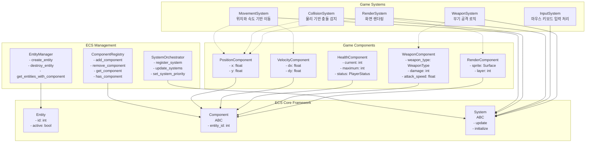

# ECS Framework Design - 방과 후 생존 게임

## 개요

"방과 후 생존"은 Entity-Component-System (ECS) 아키텍처를 기반으로 구축된 10분 하이퍼 캐주얼 로그라이크 게임입니다. 이 문서는 ECS 프레임워크의 전체 시스템 구조와 설계 원칙을 정의합니다.

## ECS 아키텍처 핵심 개념

### Entity (엔티티)
- 게임 세계의 모든 객체를 나타내는 고유 식별자
- 데이터를 직접 보유하지 않고 Component들을 연결하는 역할
- 플레이어, 적, 아이템, 발사체 등 모든 게임 오브젝트

### Component (컴포넌트)
- 순수한 데이터 컨테이너 (로직 없음)
- Entity의 특성을 정의 (위치, 체력, 속도, 렌더링 정보 등)
- `@dataclass`와 타입 힌트를 사용하여 구현

### System (시스템)
- 특정 Component 조합을 가진 Entity들에 대한 로직 처리
- 매 프레임마다 업데이트되며, 게임 상태를 변경
- 이동, 충돌, 렌더링, AI 등의 기능을 담당

## 핵심 클래스 설계



## 클래스별 상세 설계

### 1. Entity 클래스
```python
@dataclass
class Entity:
    id: int
    active: bool = True
    
    def deactivate(self) -> None:
        """엔티티를 비활성화"""
        
    def activate(self) -> None:
        """엔티티를 활성화"""
```

### 2. Component 추상 클래스
```python
from abc import ABC
from dataclasses import dataclass

@dataclass
class Component(ABC):
    entity_id: int
    
    def __post_init__(self) -> None:
        """컴포넌트 초기화 후 검증"""
```

### 3. System 추상 클래스
```python
from abc import ABC, abstractmethod
from typing import list

class System(ABC):
    @abstractmethod
    def update(self, entities: list[Entity], delta_time: float) -> None:
        """매 프레임마다 호출되는 업데이트 메서드"""
        
    @abstractmethod
    def initialize(self) -> None:
        """시스템 초기화"""
```

### 4. EntityManager 클래스
```python
class EntityManager:
    def __init__(self) -> None:
        self._next_id: int = 1
        self._entities: dict[int, Entity] = {}
        
    def create_entity(self) -> Entity:
        """새 엔티티 생성 및 고유 ID 할당"""
        
    def destroy_entity(self, entity_id: int) -> None:
        """엔티티 제거 및 관련 컴포넌트 정리"""
        
    def get_entity(self, entity_id: int) -> Entity | None:
        """ID로 엔티티 조회"""
        
    def get_entities_with_component(self, component_type: type[Component]) -> list[Entity]:
        """특정 컴포넌트를 가진 모든 엔티티 조회"""
```

### 5. ComponentRegistry 클래스
```python
from typing import TypeVar, Generic
T = TypeVar('T', bound=Component)

class ComponentRegistry:
    def __init__(self) -> None:
        self._components: dict[type[Component], dict[int, Component]] = {}
        
    def add_component(self, entity_id: int, component: T) -> None:
        """엔티티에 컴포넌트 추가"""
        
    def remove_component(self, entity_id: int, component_type: type[T]) -> None:
        """엔티티에서 컴포넌트 제거"""
        
    def get_component(self, entity_id: int, component_type: type[T]) -> T | None:
        """엔티티의 특정 컴포넌트 조회"""
        
    def has_component(self, entity_id: int, component_type: type[Component]) -> bool:
        """엔티티가 특정 컴포넌트를 가지고 있는지 확인"""
```

### 6. SystemOrchestrator 클래스
```python
from enum import IntEnum

class SystemPriority(IntEnum):
    INPUT = 0
    MOVEMENT = 1
    COLLISION = 2
    WEAPON = 3
    RENDER = 4

class SystemOrchestrator:
    def __init__(self) -> None:
        self._systems: dict[SystemPriority, list[System]] = {}
        
    def register_system(self, system: System, priority: SystemPriority) -> None:
        """시스템 등록 및 우선순위 설정"""
        
    def unregister_system(self, system: System) -> None:
        """시스템 등록 해제"""
        
    def update_systems(self, entities: list[Entity], delta_time: float) -> None:
        """등록된 모든 시스템을 우선순위 순서로 업데이트"""
```

## 게임별 컴포넌트 설계

### 핵심 컴포넌트들
```python
from enum import IntEnum
from dataclasses import dataclass, field

class WeaponType(IntEnum):
    SOCCER_BALL = 0
    BASKETBALL = 1  
    BASEBALL_BAT = 2
    
    @property
    def display_name(self) -> str:
        return ["축구공", "농구공", "야구 배트"][self.value]
    
    @property
    def damage_multiplier(self) -> float:
        return [1.2, 1.0, 1.5][self.value]

class PlayerStatus(IntEnum):
    ALIVE = 0
    INVULNERABLE = 1
    DEAD = 2

class ItemType(IntEnum):
    SOCCER_SHOES = 0  # 축구화
    BASKETBALL_SHOES = 1  # 농구화  
    RED_GINSENG = 2  # 홍삼
    MILK = 3  # 우유

@dataclass
class PositionComponent(Component):
    x: float = 0.0
    y: float = 0.0

@dataclass
class VelocityComponent(Component):
    dx: float = 0.0
    dy: float = 0.0
    max_speed: float = 200.0

@dataclass
class HealthComponent(Component):
    current: int
    maximum: int
    status: PlayerStatus = PlayerStatus.ALIVE
    regeneration_rate: float = 0.0

@dataclass
class WeaponComponent(Component):
    weapon_type: WeaponType
    damage: int
    attack_speed: float
    synergy_items: list[ItemType] = field(default_factory=list)

@dataclass
class RenderComponent(Component):
    sprite: pygame.Surface | None = None
    layer: int = 0
    visible: bool = True
```

## 시스템 실행 순서

1. **InputSystem** (우선순위: 0)
   - 마우스/키보드 입력 처리
   - 플레이어 이동 방향 결정

2. **MovementSystem** (우선순위: 1)
   - PositionComponent와 VelocityComponent 기반 이동
   - 경계 확인 및 충돌 전 위치 업데이트

3. **CollisionSystem** (우선순위: 2)
   - pymunk 물리 엔진을 사용한 충돌 감지
   - 충돌 해결 및 이벤트 발생

4. **WeaponSystem** (우선순위: 3)
   - 자동 공격 로직
   - 발사체 생성 및 관리

5. **RenderSystem** (우선순위: 4)
   - pygame 기반 화면 렌더링
   - 레이어 순서에 따른 스프라이트 그리기

## 성능 최적화 전략

### 1. 컴포넌트 접근 최적화
- 딕셔너리 기반 빠른 조회
- 캐시를 통한 반복 접근 최적화
- 메모리 풀링으로 GC 부하 감소

### 2. 시스템 실행 최적화
- 필요한 컴포넌트 조합만 조회
- 비활성 엔티티 제외
- 우선순위 기반 시스템 스케줄링

### 3. 메모리 관리
- 약한 참조를 통한 순환 참조 방지
- 엔티티 풀링으로 메모리 재사용
- 컴포넌트 제거 시 즉시 정리

## 테스트 전략

### 단위 테스트
- 각 ECS 클래스의 기본 기능 검증
- 컴포넌트 추가/제거/조회 테스트
- 시스템 등록/실행 순서 테스트

### 통합 테스트
- 엔티티-컴포넌트-시스템 간 상호작용 테스트
- 게임 시나리오 기반 워크플로우 테스트
- 성능 요구사항 (40+ FPS) 검증

### 성능 테스트
- 대량 엔티티 처리 성능 측정
- 메모리 사용량 프로파일링
- 시스템별 실행 시간 분석

## 확장성 고려사항

### 컴포넌트 확장
- 새로운 게임 요소를 위한 컴포넌트 쉽게 추가
- 기존 컴포넌트 수정 없이 기능 확장
- 타입 안전성 보장

### 시스템 확장
- 모듈식 시스템 설계로 기능별 분리
- 시스템 간 의존성 최소화
- 플러그인 방식의 시스템 추가

### 데이터 직렬화
- 게임 상태 저장/로드 지원
- 컴포넌트별 직렬화 인터페이스
- JSON 기반 설정 파일 지원

이 설계 문서는 "방과 후 생존" 게임의 ECS 프레임워크 구현을 위한 청사진을 제공하며, 모든 개발자가 일관된 아키텍처를 따를 수 있도록 가이드라인을 제시합니다.