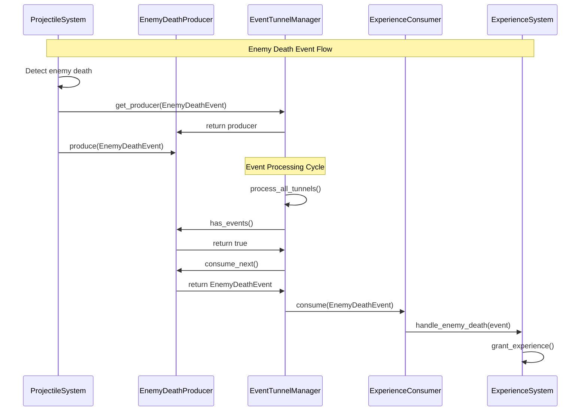
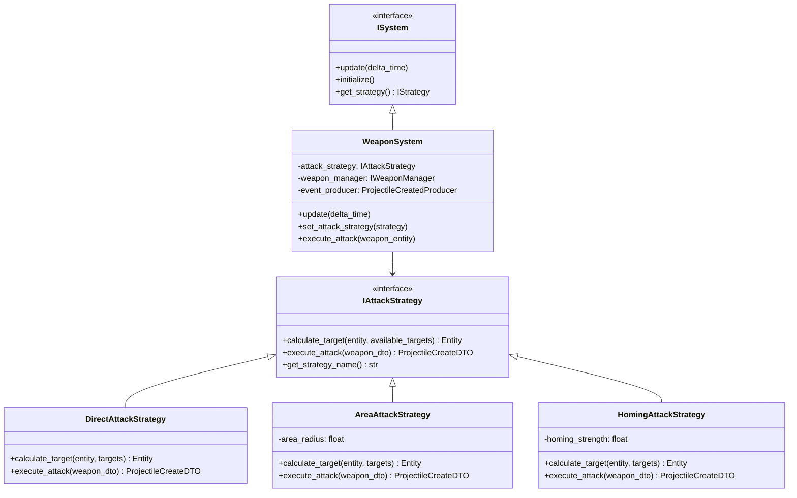
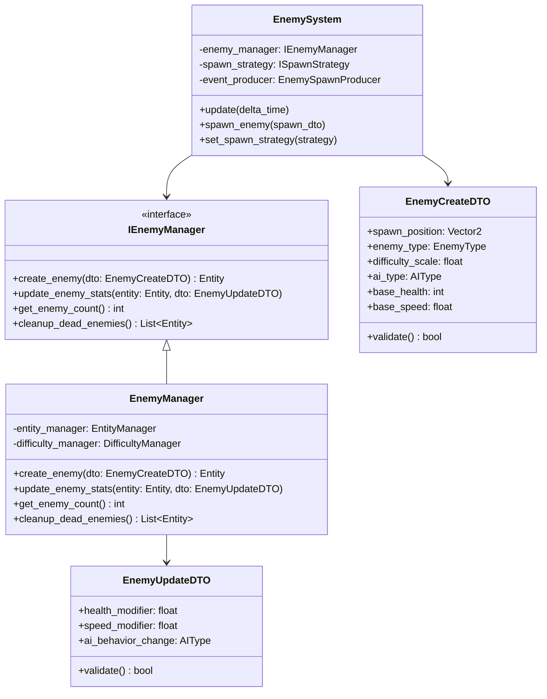
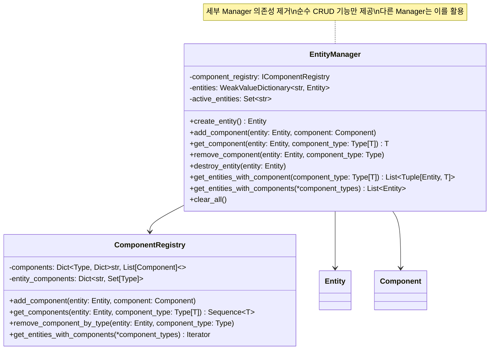
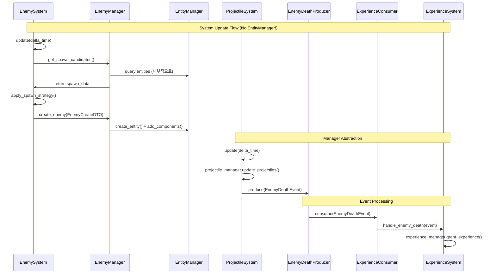

# ECS Framework Design 2.0 - 방과 후 생존 게임

## 개요

방과 후 생존 게임의 ECS 아키텍처를 **책임 분리**와 **다형성** 원칙에 따라 리팩토링한 설계 문서입니다. Producer-Consumer 패턴 기반 이벤트 시스템과 전략 패턴을 적용한 System, 그리고 인터페이스 기반 Manager 계층을 통해 복잡성을 줄이고 확장성을 확보합니다.

## 핵심 설계 원칙

### 1. 명확한 책임 분리
- **Entity**: 순수한 식별자
- **Component**: 순수한 데이터 컨테이너  
- **System**: 게임 로직 + 전략 패턴
- **Manager**: 특화된 생성/관리 서비스
- **EventTunnelManager**: Producer-Consumer 쌍 관리

### 2. 다형성 기반 확장성
- System의 전략 패턴 적용
- Manager의 인터페이스 추상화
- DTO 기반 타입 안전성

### 3. Producer-Consumer 이벤트 처리
- EventBus 대신 타입 안전한 터널 방식
- System 간 느슨한 결합
- 성능 최적화된 큐 기반 처리

## 전체 아키텍처 다이어그램

```mermaid
graph TB
    subgraph "Core ECS Framework"
        Entity[Entity<br/>- entity_id: str<br/>- active: bool]
        Component[Component<br/>ABC<br/>- validate<br/>- serialize]
        ISystem[ISystem<br/>ABC<br/>- update: delta_time<br/>- get_strategy]
        System[System<br/>- manager: IManager<br/>- strategy: IStrategy<br/>- update: delta_time]
    end
    
    subgraph "Pure CRUD Layer"
        EntityManager[EntityManager<br/>순수 CRUD만<br/>- create_entity<br/>- add_component<br/>- get_component<br/>- destroy_entity]
        ComponentRegistry[ComponentRegistry<br/>- 컴포넌트 저장소<br/>- 다중 컴포넌트 지원]
    end
    
    subgraph "Specialized Manager Layer"
        IEnemyManager[IEnemyManager<br/>ABC<br/>- create_enemy<br/>- update_enemy_stats]
        EnemyManager[EnemyManager<br/>- create_from_dto<br/>- update_from_dto]
        
        IWeaponManager[IWeaponManager<br/>ABC<br/>- create_weapon<br/>- apply_upgrades]
        WeaponManager[WeaponManager<br/>- create_from_dto<br/>- apply_synergy]
        
        IProjectileManager[IProjectileManager<br/>ABC<br/>- create_projectile<br/>- handle_collision]
        ProjectileManager[ProjectileManager<br/>- create_from_dto<br/>- physics_update]
    end
    
    subgraph "DTO Layer"
        EnemyCreateDTO[EnemyCreateDTO<br/>- spawn_position<br/>- enemy_type<br/>- difficulty_scale]
        WeaponCreateDTO[WeaponCreateDTO<br/>- weapon_type<br/>- base_stats<br/>- synergy_items]
        ProjectileCreateDTO[ProjectileCreateDTO<br/>- start_position<br/>- direction<br/>- damage<br/>- speed]
    end
    
    subgraph "Strategy Pattern Systems"
        EnemySystem[EnemySystem<br/>- enemy_manager: IEnemyManager<br/>- spawn_strategy: ISpawnStrategy<br/>- update: delta_time]
        WeaponSystem[WeaponSystem<br/>- weapon_manager: IWeaponManager<br/>- attack_strategy: IAttackStrategy<br/>- update: delta_time]
        ProjectileSystem[ProjectileSystem<br/>- projectile_manager: IProjectileManager<br/>- movement_strategy: IMovementStrategy<br/>- update: delta_time]
    end
    
    subgraph "Producer-Consumer Event System"
        EventTunnelManager[EventTunnelManager<br/>- manage_tunnels<br/>- create_producer_consumer_pair]
        
        Producer1[EnemyDeathProducer<br/>- produce: EnemyDeathEvent]
        Consumer1[ExperienceConsumer<br/>- consume: EnemyDeathEvent<br/>- grant_experience]
        
        Producer2[LevelUpProducer<br/>- produce: LevelUpEvent]
        Consumer2[WeaponUpgradeConsumer<br/>- consume: LevelUpEvent<br/>- upgrade_weapons]
        
        Producer3[ProjectileHitProducer<br/>- produce: ProjectileHitEvent]
        Consumer3[DamageConsumer<br/>- consume: ProjectileHitEvent<br/>- apply_damage]
    end
    
    subgraph "Strategy Implementations"
        ISpawnStrategy[ISpawnStrategy<br/>ABC<br/>- calculate_spawn_position<br/>- determine_enemy_type]
        RandomSpawnStrategy[RandomSpawnStrategy]
        WaveSpawnStrategy[WaveSpawnStrategy]
        BossSpawnStrategy[BossSpawnStrategy]
        
        IAttackStrategy[IAttackStrategy<br/>ABC<br/>- calculate_target<br/>- execute_attack]
        DirectAttackStrategy[DirectAttackStrategy]
        AreaAttackStrategy[AreaAttackStrategy]
        HomingAttackStrategy[HomingAttackStrategy]
    end
    
    %% 의존성 관계
    EntityManager --> ComponentRegistry
    EntityManager --> Entity
    EntityManager --> Component
    
    %% Manager 의존성
    EnemyManager --> IEnemyManager
    WeaponManager --> IWeaponManager
    ProjectileManager --> IProjectileManager
    
    EnemyManager --> EntityManager
    WeaponManager --> EntityManager
    ProjectileManager --> EntityManager
    
    %% System과 Manager 관계
    EnemySystem --> IEnemyManager
    WeaponSystem --> IWeaponManager
    ProjectileSystem --> IProjectileManager
    
    %% System과 Strategy 관계
    EnemySystem --> ISpawnStrategy
    WeaponSystem --> IAttackStrategy
    RandomSpawnStrategy --> ISpawnStrategy
    WaveSpawnStrategy --> ISpawnStrategy
    DirectAttackStrategy --> IAttackStrategy
    AreaAttackStrategy --> IAttackStrategy
    
    %% DTO 사용
    EnemySystem --> EnemyCreateDTO
    WeaponSystem --> WeaponCreateDTO
    ProjectileSystem --> ProjectileCreateDTO
    
    %% Producer-Consumer 관계
    EventTunnelManager --> Producer1
    EventTunnelManager --> Consumer1
    EventTunnelManager --> Producer2
    EventTunnelManager --> Consumer2
    
    Producer1 -.-> Consumer1
    Producer2 -.-> Consumer2
    Producer3 -.-> Consumer3
    
    %% System이 Producer 사용
    ProjectileSystem --> Producer1
    EnemySystem --> Producer2
    WeaponSystem --> Producer3
```



## 상세 설계

### 1. Producer-Consumer 이벤트 시스템



**EventTunnelManager 핵심 기능:**
```python
class EventTunnelManager:
    def create_tunnel[T](self, event_type: type[T]) -> tuple[EventProducer[T], EventConsumer[T]]
    def get_producer[T](self, event_type: type[T]) -> EventProducer[T]
    def get_consumer[T](self, event_type: type[T]) -> EventConsumer[T]
    def process_all_tunnels(self) -> dict[type, int]  # 처리된 이벤트 수 반환
```

### 2. System 전략 패턴 적용



**System 전략 교체 예시:**
```python
# 게임 상황에 따른 동적 전략 변경
weapon_manager = WeaponManager(entity_manager)
weapon_system = WeaponSystem(weapon_manager)

# 일반 상황: 직접 공격
weapon_system.set_attack_strategy(DirectAttackStrategy())

# 보스전: 광역 공격  
weapon_system.set_attack_strategy(AreaAttackStrategy(radius=100))

# 특수 아이템 획득: 유도 공격
weapon_system.set_attack_strategy(HomingAttackStrategy(strength=0.8))

# System 업데이트 (entity_manager 없이!)
weapon_system.update(delta_time=0.016)
```

### 3. Manager 인터페이스와 DTO



**새로운 System 인터페이스:**
```python
class ISystem(ABC):
    @abstractmethod
    def update(self, delta_time: float) -> None:
        """System 업데이트 (entity_manager 불필요)"""
        pass
    
    @abstractmethod
    def initialize(self) -> None:
        """System 초기화"""
        pass

class WeaponSystem(ISystem):
    def __init__(self, weapon_manager: IWeaponManager):
        self.weapon_manager = weapon_manager
        self.attack_strategy: IAttackStrategy = DirectAttackStrategy()
    
    def update(self, delta_time: float) -> None:
        # Manager가 내부적으로 EntityManager 사용
        active_weapons = self.weapon_manager.get_active_weapons()
        
        for weapon_entity in active_weapons:
            if self.weapon_manager.can_attack(weapon_entity, delta_time):
                # Strategy 패턴 적용
                target = self.attack_strategy.find_target(weapon_entity)
                if target:
                    attack_dto = self.attack_strategy.create_attack_dto(weapon_entity, target)
                    self.weapon_manager.execute_attack(attack_dto)
```

### 4. 순수 EntityManager CRUD



**EntityManager 리팩토링 전후:**

**❌ 기존 (복잡한 책임):**
```python
class EntityManager:
    def create_enemy_entity(self, spawn_result) -> Entity  # 특수 생성
    def get_enemy_count(self) -> int  # 특수 조회
    def _ensure_managers_initialized(self)  # 매니저 관리
```

**✅ 리팩토링 후 (순수 CRUD):**
```python
class EntityManager:
    def create_entity(self) -> Entity
    def add_component(self, entity: Entity, component: Component)
    def get_component(self, entity: Entity, component_type: type[T]) -> T | None
    def destroy_entity(self, entity: Entity)
    # 특수 생성/관리 로직 제거
```

### 5. 시스템 간 협력 흐름



## 마이그레이션 계획

### Phase 1: Producer-Consumer 이벤트 시스템
1. `EventTunnelManager` 구현
2. `EventProducer<T>`, `EventConsumer<T>` 제네릭 클래스
3. 기존 `EventBus` 점진적 대체

### Phase 2: System 전략 패턴 적용
1. `IAttackStrategy`, `ISpawnStrategy` 인터페이스 정의
2. 기존 `AutoAttackSystem` 전략 패턴으로 리팩토링
3. `EnemySystem`, `WeaponSystem` 전략 패턴 적용

### Phase 3: Manager 인터페이스화
1. `IEnemyManager`, `IWeaponManager` 인터페이스 추출
2. DTO 클래스 정의 (`EnemyCreateDTO`, `WeaponCreateDTO`)
3. System-Manager 간 DTO 기반 통신 구현

### Phase 4: EntityManager 순수화
1. `EntityManager`에서 특수 생성 메서드 제거
2. 세부 Manager 의존성 제거
3. 순수 CRUD 기능만 유지

## 설계 효과

### 1. 책임 분리 달성
- **EntityManager**: 순수 CRUD만 담당
- **Manager**: 특화된 생성/관리 서비스 제공
- **System**: 게임 로직 + 전략 패턴 적용

### 2. 다형성 기반 확장성
- Strategy 패턴으로 런타임 행동 변경 가능
- Interface 기반 Manager 교체 가능
- DTO 기반 타입 안전성 보장

### 3. 성능 최적화
- Producer-Consumer로 이벤트 처리 최적화
- 타입별 전용 큐로 캐시 친화적 처리
- 불필요한 이벤트 브로드캐스팅 제거

### 4. 테스트 용이성
- Mock Manager 주입으로 단위 테스트 격리
- Strategy 패턴으로 개별 로직 테스트 가능
- DTO 기반 입출력으로 테스트 데이터 관리 용이

---

이 설계는 **단순성**, **확장성**, **성능**을 모두 고려한 현대적인 ECS 아키텍처를 제공하며, 게임 개발의 복잡성을 효과적으로 관리할 수 있는 구조를 제시합니다.